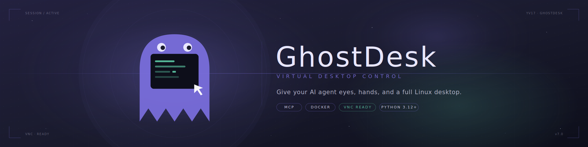

<p align="center">
  
</p>

<p align="center">
  
  
  
  
</p>

<p align="center">
  <strong>Give your AI agent eyes, hands, and a full Linux desktop.</strong><br>
  An MCP server that lets LLM agents see the screen, move the mouse, type on the keyboard, launch apps, and run shell commands — all inside a sandboxed virtual desktop.
</p>

<p align="center">
  <em>If a human can do it on a desktop, your agent can too.</em>
</p>

<p align="center">
  <video src="https://github.com/user-attachments/assets/304ba0b6-4ba8-49df-9825-a3bb78c2727e" controls muted playsinline width="960">
    Your browser does not support the video tag.
  </video>
</p>

<p align="center">
  <em>GhostDesk demo — from a single prompt (<strong>"open the browser, go to Google News, and tell me the latest headlines in the Technology section"</strong>), the agent launches Firefox, navigates to Google News, switches to the Technology section, and reports the latest stories back.</em>
</p>

---

## Table of contents

- [Why GhostDesk?](#why-ghostdesk)
- [How it works](#how-it-works)
- [Quick start](#quick-start)
- [Secure local run (TLS + auth)](#secure-local-run-tls--auth)
- [Tools](#tools)
- [Model requirements](#model-requirements)
- [From one agent to a workforce](#from-one-agent-to-a-workforce)
- [Configuration](#configuration)
- [Security](#security)
- [Troubleshooting](#troubleshooting)
- [Custom image](#custom-image)
- [License](#license)

---

## Why GhostDesk?

Browser automation tools (Playwright, Puppeteer, Selenium…) were built for human test engineers driving a browser with selectors. They do one thing, and they do it well — inside the browser.

GhostDesk is built from the other end: for **AI agents**, driving **everything a desktop runs**. Browsers, native apps, IDEs, terminals, office suites, legacy software, internal tools. If it renders pixels on screen, your agent can see it and use it — in one conversation, across many applications, without a line of glue code.

You don't write selectors. You write a prompt:

> *"Open the CRM, export last month's leads as CSV, open LibreOffice Calc, build a pivot table, screenshot the chart, and email it to the team."*

The agent opens the browser, logs in, downloads the file, switches to LibreOffice, processes the data, captures the result, composes the email, sends it. One prompt, multiple apps, fully autonomous — no glue code, no per-site scraper, no brittle selector chain.

That is what *agents using a desktop* looks like.

### Runs on models you can actually host

Desktop control needs to be **fast** — an agent that takes twelve seconds to decide where to click is unusable. GhostDesk is tuned so that vision-language models from the Qwen family running on a single workstation GPU are a first-class target, not an afterthought. No API bill, no screenshots of your desktop leaving your network.

Frontier models (Claude, GPT-4o, Gemini) work too and remain the smoothest path — but they are not the bar. See [Model requirements](#model-requirements) for the supported stacks and the one coordinate-space setting that matters.

---

## How it works

GhostDesk runs a virtual Linux desktop inside Docker and exposes it as an MCP server. Your agent gets a sandboxed desktop with a taskbar, clock, and pre-installed applications — equivalent to what a human sees on their screen.

The agent perceives the screen by calling `screen_shot()`, which captures the full desktop at native resolution and returns it as WebP (or PNG). An optional `region=` argument can crop to a sub-rectangle when the agent explicitly wants to narrow its focus.

This works with **any application** — web apps, native apps, legacy software, Canvas, WebGL.

---

## Quick start

### 1. Run the container

One command, plain HTTP, no password. Fine for kicking the tires on a laptop you trust — **not fit for anything beyond that**. Ready to harden it? Jump to [Secure local run](#secure-local-run-tls--auth).

```bash
docker run -d --name ghostdesk-demo \
  --shm-size 2g \
  -p 3000:3000 \
  -p 6080:6080 \
  ghcr.io/yv17labs/ghostdesk:latest
```

The `latest` image ships with **Firefox**, the **foot** terminal, **mousepad** (text editor), **galculator**, and passwordless `sudo` for the `agent` user — enough to demo a browsing + note-taking workflow out of the box. Need a different app set? Build your own on top of `base` — see [Custom image](#custom-image).

The container boots in the dev posture: plain HTTP on both ports, every auth gate disarmed on purpose. You'll see warnings in the logs reminding you of that — they go away once you follow the secured path below.

### 2. Connect your AI

GhostDesk speaks [MCP](https://modelcontextprotocol.io/) over the Streamable HTTP transport — any MCP-compatible client can drive it. Point your client at `http://localhost:3000/mcp`:

**Claude Desktop / Claude Code**
```json
{
  "mcpServers": {
    "ghostdesk": {
      "type": "http",
      "url": "http://localhost:3000/mcp"
    }
  }
}
```

**Any other MCP-compatible client** — same URL, no headers, no auth. That's the whole demo posture.

### 3. Watch your agent work

Open `http://localhost:6080/` in your browser to see the virtual desktop in real time. No password prompt — the dev posture skips it.

| Service | URL |
|---------|-----|
| MCP server | `http://localhost:3000/mcp` |
| noVNC (browser) | `http://localhost:6080/` |

Give your agent a first prompt to confirm the wiring is right:

> *"Take a screenshot of the desktop, list the installed applications, then open Firefox and go to wikipedia.org."*

You should see Firefox launch in the noVNC tab, the URL bar fill in, and the page load — all under your agent's control.

### 4. When you're done

```bash
docker stop ghostdesk-demo && docker rm ghostdesk-demo
```

The demo run creates no named volume, so this leaves nothing behind.

---

## Secure local run (TLS + auth)

The Quick start above drops every gate so you can kick the tires in thirty seconds. The moment you want to expose this to anything beyond your own laptop — another machine on your LAN, a devcontainer port-forward on an untrusted network, a teammate's browser — flip to the secured posture: real TLS + bearer-token auth on MCP + password prompt on noVNC.

GhostDesk couples **TLS and auth**: mount a cert and you get `wss://` + bearer-token on MCP + a single-password prompt on noVNC (see [Security](#security) → *Auth ≡ TLS*). [`mkcert`](https://github.com/FiloSottile/mkcert) issues a browser-trusted cert for `localhost` in two commands:

```bash
# Issue a locally-trusted cert (first time only — installs a local CA in your trust store)
mkcert -install
mkdir -p tls
mkcert -cert-file tls/server.crt -key-file tls/server.key localhost 127.0.0.1 ::1

# Generate the MCP and VNC secrets
export GHOSTDESK_AUTH_TOKEN=$(openssl rand -hex 32)
export GHOSTDESK_VNC_PASSWORD=$(openssl rand -hex 16)
```

Pick a container name that matches the agent's role — `sales-agent`, `research-agent`, `accounting-agent`… Below we use `my-agent` as a placeholder; replace it everywhere in the command.

```bash
# Run the container — cert mounted, TLS + auth enabled everywhere
docker run -d --name ghostdesk-my-agent \
  --restart unless-stopped \
  --cap-add SYS_ADMIN \
  --shm-size 2g \
  -p 3000:3000 \
  -p 6080:6080 \
  -v ghostdesk-my-agent-home:/home/agent \
  -v "$PWD/tls/server.crt:/etc/ghostdesk/tls/server.crt:ro" \
  -v "$PWD/tls/server.key:/etc/ghostdesk/tls/server.key:ro" \
  -e GHOSTDESK_AUTH_TOKEN \
  -e GHOSTDESK_VNC_PASSWORD \
  -e TZ=America/New_York \
  -e LANG=en_US.UTF-8 \
  ghcr.io/yv17labs/ghostdesk:latest

echo "MCP token:    $GHOSTDESK_AUTH_TOKEN"
echo "VNC password: $GHOSTDESK_VNC_PASSWORD"
```

Once the container is up, update your MCP client config — same shape as the demo, now over `https://` with a bearer token:

**Claude Desktop / Claude Code**
```json
{
  "mcpServers": {
    "ghostdesk": {
      "type": "http",
      "url": "https://localhost:3000/mcp",
      "headers": {
        "Authorization": "Bearer <paste $GHOSTDESK_AUTH_TOKEN here>"
      }
    }
  }
}
```

**Any other MCP-compatible client** — same URL, plus an `Authorization: Bearer <token>` header in whatever form your client accepts.

Then open `https://localhost:6080/` in your browser — the `mkcert` CA installed by `mkcert -install` is already in your trust store, so the browser accepts the cert with no warning. noVNC will prompt for `$GHOSTDESK_VNC_PASSWORD`.

> **Going to production?** Swap the `mkcert` leaf for a real cert, source both secrets from your secret manager, and front port 6080 with an identity-aware proxy — [SECURITY.md](SECURITY.md) has the full contract.

> **`--cap-add SYS_ADMIN`** — Required by Electron apps (VS Code, Slack, etc.) and other applications that need Linux user namespaces to run their sandbox. Safe to remove if you don't need them.

The named volume persists the agent's home directory across restarts — browser passwords, bookmarks, cookies, downloads, and desktop preferences are all preserved. On the first run, Docker automatically seeds the volume with the default configuration from the image.

---

## Tools

13 tools at your agent's fingertips, grouped by concern (`verb_noun` naming):

### Screen
| Tool | Description |
|------|-------------|
| `screen_shot` | Capture the screen as a WebP image (pass `format="png"` for lossless). Pass `region=` to crop to a sub-rectangle at native resolution. Set `stabilize=False` to skip page stabilization checks (default: True, waits max 5 sec for page to stabilize) |

### Mouse
| Tool | Description |
|------|-------------|
| `mouse_move` | Move the cursor to coordinates without clicking — reveals hover-only menus, tooltips, and CSS `:hover` states (e.g. Gmail action bar) |
| `mouse_click` | Click at coordinates |
| `mouse_double_click` | Double-click at coordinates |
| `mouse_drag` | Drag from one position to another |
| `mouse_scroll` | Scroll in any direction (up/down/left/right) |

### Keyboard
| Tool | Description |
|------|-------------|
| `key_type` | Type text with realistic per-character delays |
| `key_press` | Press keys or combos (`ctrl+c`, `alt+F4`, `Return`...) |

### Clipboard
| Tool | Description |
|------|-------------|
| `clipboard_get` | Read clipboard contents |
| `clipboard_set` | Write to clipboard |

### Apps
| Tool | Description |
|------|-------------|
| `app_list` | List the GUI applications installed on the desktop |
| `app_launch` | Start a GUI application by name |
| `app_status` | Check if an application is running and read its logs |

---

## Model requirements

Your inference stack must cover four capabilities — all four are mandatory:

1. **Text + vision** — the agent perceives the desktop through screenshots and needs a model that can interpret them.
2. **Tool use** — GhostDesk exposes 12 tools as function calls; the model must be able to invoke them.
3. **MCP client** — the host needs to speak Streamable HTTP MCP to reach the GhostDesk server.
4. **WebP image support** — GhostDesk returns screenshots as WebP by default to keep payloads small and inference fast. A stack that can only decode PNG or JPEG will not work out of the box.

### Coordinate space — `GhostDesk-Model-Space` header

By default no header is needed: Claude and the other major frontier LLMs work out of the box. **Qwen3.x** need the client to send `GhostDesk-Model-Space: 1000` on every MCP request.

Example MCP client config:

```json
{
  "mcpServers": {
    "ghostdesk": {
      "url": "https://localhost:3000/mcp",
      "headers": {
        "GhostDesk-Model-Space": "1000"
      }
    }
  }
}
```

### Running locally

For self-hosted inference we use and recommend our fork of llama.cpp, which adds WebP decoding and turbo quant on top of upstream: [YV17labs/llama.cpp](https://github.com/YV17labs/llama.cpp), branch `integration/webp-turbo`. The day WebP lands upstream we will archive the fork and point there directly.

> **macOS users: use llama.cpp, not mlx-vlm (as of 2026-04-01).** The mlx-vlm stack currently produces inaccurate coordinate outputs for the same models that work correctly under llama.cpp. This is caused by an upstream bug in an Apple dependency, not the model itself. Until the fix lands, llama.cpp is the recommended backend on every platform — including Apple Silicon Macs.

Run whatever local model you like. Four from the Qwen vision family that I've used and that work well for desktop control:

- **[Qwen3.6-27B](https://huggingface.co/Qwen/Qwen3.6-27B)** — dense 27B; as of today the strongest of the four on complex, multi-step tasks, at the cost of slower inference.
- **[Qwen3.6-35B-A3B](https://huggingface.co/Qwen/Qwen3.6-35B-A3B)** — 35B parameters, only 3B active per token.

---

## From one agent to a workforce

Each GhostDesk instance is a container. Spin up one, ten, or a hundred — each agent gets its own isolated desktop, its own apps, its own role. Think of it as hiring a team of digital employees, each with their own workstation.

### Scale horizontally

```yaml
# docker-compose.yml — 3 specialized agents, one command
#
# Prerequisites: the TLS cert + key at ./tls and the two secrets
# (GHOSTDESK_AUTH_TOKEN, GHOSTDESK_VNC_PASSWORD) in your environment or a
# .env file. Generate both exactly as shown in the Secure local run
# section above. See SECURITY.md for the production secret-handling
# contract.

x-ghostdesk-defaults: &ghostdesk-defaults
  image: ghcr.io/yv17labs/ghostdesk:latest
  restart: unless-stopped
  cap_add: [SYS_ADMIN]
  shm_size: 2g
  environment:
    - GHOSTDESK_AUTH_TOKEN
    - GHOSTDESK_VNC_PASSWORD
    - TZ=America/New_York
    - LANG=en_US.UTF-8

services:
  sales-agent:
    <<: *ghostdesk-defaults
    container_name: ghostdesk-sales-agent
    ports: ["3001:3000", "6081:6080"]
    volumes:
      - ghostdesk-sales-agent-home:/home/agent
      - ./tls/server.crt:/etc/ghostdesk/tls/server.crt:ro
      - ./tls/server.key:/etc/ghostdesk/tls/server.key:ro

  research-agent:
    <<: *ghostdesk-defaults
    container_name: ghostdesk-research-agent
    ports: ["3002:3000", "6082:6080"]
    volumes:
      - ghostdesk-research-agent-home:/home/agent
      - ./tls/server.crt:/etc/ghostdesk/tls/server.crt:ro
      - ./tls/server.key:/etc/ghostdesk/tls/server.key:ro

  accounting-agent:
    <<: *ghostdesk-defaults
    container_name: ghostdesk-accounting-agent
    ports: ["3003:3000", "6083:6080"]
    volumes:
      - ghostdesk-accounting-agent-home:/home/agent
      - ./tls/server.crt:/etc/ghostdesk/tls/server.crt:ro
      - ./tls/server.key:/etc/ghostdesk/tls/server.key:ro

volumes:
  ghostdesk-sales-agent-home:
  ghostdesk-research-agent-home:
  ghostdesk-accounting-agent-home:
```

```bash
docker compose up -d   # Your workforce is ready
```

Each agent runs in parallel, independently, on its own desktop. Connect each to a different LLM, give each a different system prompt, install different apps — full specialization.

### Secure by design

Every agent is sandboxed in its own container. No access to the host machine. No access to other agents. Network, filesystem, and process isolation come free from Docker.

This makes GhostDesk a natural fit for enterprises:

| Concern | How GhostDesk handles it |
|---------|--------------------------|
| **Data isolation** | Each agent lives in its own container — no shared filesystem, no shared memory |
| **Access control** | Restrict network access per agent with Docker networking. An agent with CRM access doesn't see finance tools |
| **Auditability** | Watch any agent live via VNC, record sessions, review screenshots |
| **Blast radius** | If an agent goes wrong, kill the container. Nothing else is affected |
| **Compliance** | No data touches your host. Containers can run in air-gapped environments |

### Specialize each agent

Give each agent a role, like you would a new hire:

- **Sales agent** — monitors the CRM, enriches leads, updates the pipeline
- **Research agent** — browses the web, compiles competitive intelligence, writes reports
- **Accounting agent** — processes invoices in legacy ERP software, reconciles spreadsheets
- **QA agent** — clicks through your app, files bug reports with screenshots
- **Support agent** — handles tickets, looks up customer info across multiple internal tools

Each agent gets its own system prompt defining its mission, its own installed applications, and its own network permissions. Manage AI agents like employees — each with their own desktop, their own tools, and their own clearance level.

### Supervise in real time

Every agent exposes a VNC/noVNC endpoint. Open a browser tab and watch your agent work — or open ten tabs and monitor your entire workforce. Intervene at any time: take over the mouse, correct course, or chat with the orchestrating LLM.

---

## Configuration

Every variable GhostDesk reads is namespaced under `GHOSTDESK_*`. Standard POSIX variables (`TZ`, `LANG`) are kept as-is so the existing Unix ecosystem keeps working.

### Secrets (required — container refuses to boot without them)

| Variable | Description |
|----------|-------------|
| `GHOSTDESK_AUTH_TOKEN` | Bearer token required on every MCP request. Generate with `openssl rand -hex 32`. |
| `GHOSTDESK_VNC_PASSWORD` | Password for wayvnc (username is `agent` in the prod image). Generate with `openssl rand -hex 16`. |

Both are plain environment variables. Wire them from your secret store (`secretKeyRef` on Kubernetes, Docker secrets / Vault / AWS SM on compose) — see [SECURITY.md](SECURITY.md#secrets-handling--rotation) for the full contract.

### Runtime knobs

| Variable | Default | Description |
|----------|---------|-------------|
| `GHOSTDESK_PORT` | `3000` | MCP server listening port |
| `GHOSTDESK_HOST` | `127.0.0.1` (standalone) / `0.0.0.0` (container) | Bind address for the MCP endpoint. Defaults to loopback per [MCP transports spec](https://modelcontextprotocol.io/specification/2025-06-18/basic/transports#streamable-http); the container's entrypoint exports `0.0.0.0` so Docker's port-publishing layer can reach it. |
| `GHOSTDESK_ALLOWED_ORIGINS` | *(empty)* | Comma-separated list of `Origin` headers accepted from browser clients (e.g. `https://app.example.com,https://localhost:8080`). Non-browser clients (Claude Desktop, SDKs, `curl`) send no `Origin` and are always allowed. Required for any browser-based MCP UI; without it, browser requests are rejected with HTTP 403 to mitigate DNS rebinding (per MCP transports spec). |
| `GHOSTDESK_TLS_CERT` | `/etc/ghostdesk/tls/server.crt` | Path to the TLS certificate. When the file exists, `websockify` and the MCP server auto-switch to `wss://` / `https://`. See [Security](#security). |
| `GHOSTDESK_TLS_KEY` | `/etc/ghostdesk/tls/server.key` | Path to the TLS private key (matching `GHOSTDESK_TLS_CERT`). |
| `GHOSTDESK_SCREEN_WIDTH` | `1280` | Virtual screen width in pixels |
| `GHOSTDESK_SCREEN_HEIGHT` | `1024` | Virtual screen height in pixels |
| `TZ` | `America/New_York` | IANA timezone (POSIX standard, e.g. `Europe/Paris`) |
| `LANG` | `en_US.UTF-8` | POSIX locale (e.g. `fr_FR.UTF-8`) |

### Pinned values (not configurable)

| Variable | Value | Rationale |
|----------|-------|-----------|
| `GHOSTDESK_VNC_ADDRESS` | `127.0.0.1` | wayvnc is locked to loopback inside the container's netns; the VNC port is only reachable via the noVNC bridge on 6080. Override attempts are logged and ignored — see [SECURITY.md](SECURITY.md#transport-security). |

---

## Security

GhostDesk owns two things: **transport encryption** and **authentication**. Everything else (rate limiting, SSO, WAF, session recording, brute-force protection, per-user identity on noVNC) is a reverse-proxy concern — the container is designed to run behind one, not directly on the internet.

The full threat model, the *Auth ≡ TLS* posture switch, the wayvnc RFB-type-2-inside-`wss://` rationale, the secrets handling contract, and the exhaustive in-scope / out-of-scope table all live in **[SECURITY.md](SECURITY.md)** — single source of truth. Start there before deploying to anything you don't fully trust.

Reporting a vulnerability? Use GitHub's [private security advisory](../../security/advisories) — see [SECURITY.md § Reporting](SECURITY.md#reporting-security-vulnerabilities).

---

## Troubleshooting

### My agent's clicks land off-target by a huge margin

Almost always a coordinate-space mismatch. Frontier models (Claude, GPT-4o, Gemini) need no header (default pass-through); the Qwen vision family needs the client to send `GhostDesk-Model-Space: 1000` on every MCP request. Full rationale in [Model requirements](#model-requirements) → *Coordinate space*.

### The container refuses to start with a secrets error

The prod posture (cert mounted) **requires** both `GHOSTDESK_AUTH_TOKEN` and `GHOSTDESK_VNC_PASSWORD` to be set — GhostDesk refuses to boot without them on purpose, to prevent an unauthenticated prod container. Generate them as shown in [Secure local run](#secure-local-run-tls--auth) and pass them with `-e`. The demo posture (no cert) has no such requirement.

### noVNC shows a black screen or the desktop renders with graphical glitches

You're probably short on shared memory. Browsers and other GPU-accelerated apps inside the container need a reasonable `/dev/shm` — `--shm-size 2g` is the baseline in every example and should not be trimmed. If you already have `--shm-size 2g`, check the container logs for wayvnc or compositor errors.

### Firefox / Electron apps fail to launch or crash immediately

Electron-based apps (VS Code, Slack, Discord…) need Linux user namespaces for their sandbox. Add `--cap-add SYS_ADMIN` to your `docker run` (already present in the Secure local run example). Firefox itself works without it.

---

## Custom image

The `base` tag provides GhostDesk without any pre-installed GUI application — just the virtual desktop, VNC, and the MCP server. Use it to build your own image with only the tools you need:

```dockerfile
FROM ghcr.io/yv17labs/ghostdesk:base

RUN apt-get update \
    && apt-get install -y --no-install-recommends \
        chromium-browser \
        libreoffice-calc \
    && rm -rf /var/lib/apt/lists/*
```

```bash
docker build -t my-agent .
```

See the project's [Dockerfile](Dockerfile) for a complete example.

| Tag | Description |
|-----|-------------|
| `latest`, `X.Y.Z`, `X.Y` | Full image — Firefox, foot terminal, mousepad, galculator, passwordless sudo |
| `base`, `base-X.Y.Z`, `base-X.Y` | Minimal image — no GUI app, meant to be extended |

---

## License

**[Functional Source License, Version 1.1, ALv2 Future License](https://fsl.software/) (FSL-1.1-ALv2)** — see [LICENSE](LICENSE) for the authoritative terms.

**What this means in practice** *(informal summary — the LICENSE file governs; this is not legal advice)*:

- **Permitted purposes** cover the use cases that matter for the vast majority of users: internal use and access inside your company, non-commercial education and research, and professional services you provide to a licensee who is using GhostDesk in accordance with the license. Self-hosting GhostDesk to run your own agents — even commercial, revenue-generating workflows that power *your* product — is a permitted internal use.
- **Competing Use is prohibited.** You may not make GhostDesk available to others in a commercial product or service that substitutes for GhostDesk, substitutes for any product or service the project offers using GhostDesk, or provides the same or substantially similar functionality. In short: you cannot take GhostDesk and rebrand it, host it as a paid service, or build a competing desktop-automation-for-agents product from it.
- **Apache 2.0 in two years.** Each released version of GhostDesk becomes available under the Apache License 2.0 on the second anniversary of its release, automatically and irrevocably. The Competing Use restriction only applies for those first two years.

**Commercial licensing.** If your intended use falls under Competing Use — you want to resell GhostDesk, offer it as a managed service, or build a competing product — contact the maintainers to discuss a commercial license before deploying. Open a GitHub issue or reach out directly; we are happy to talk.
