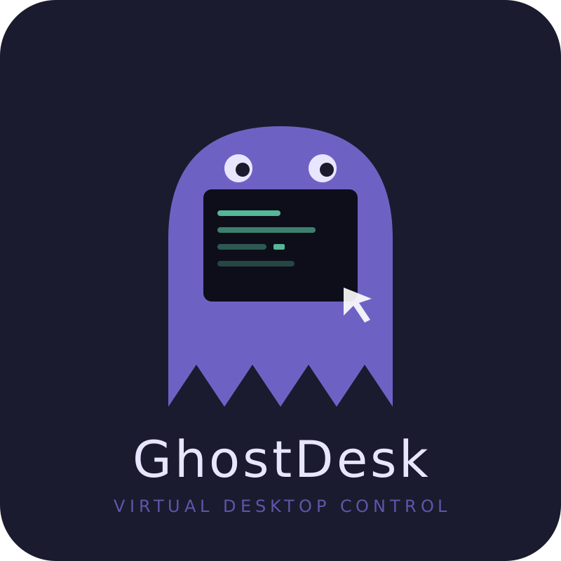
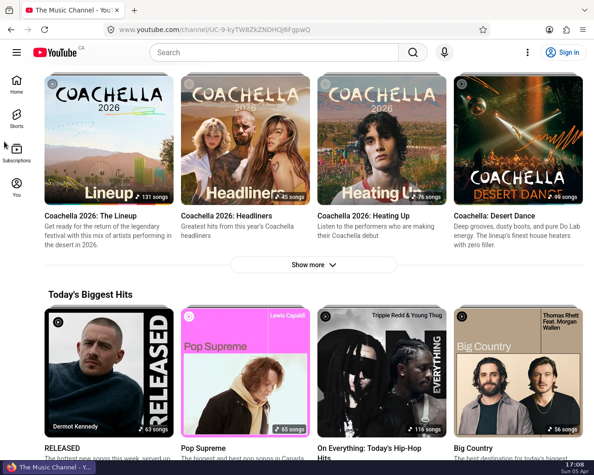
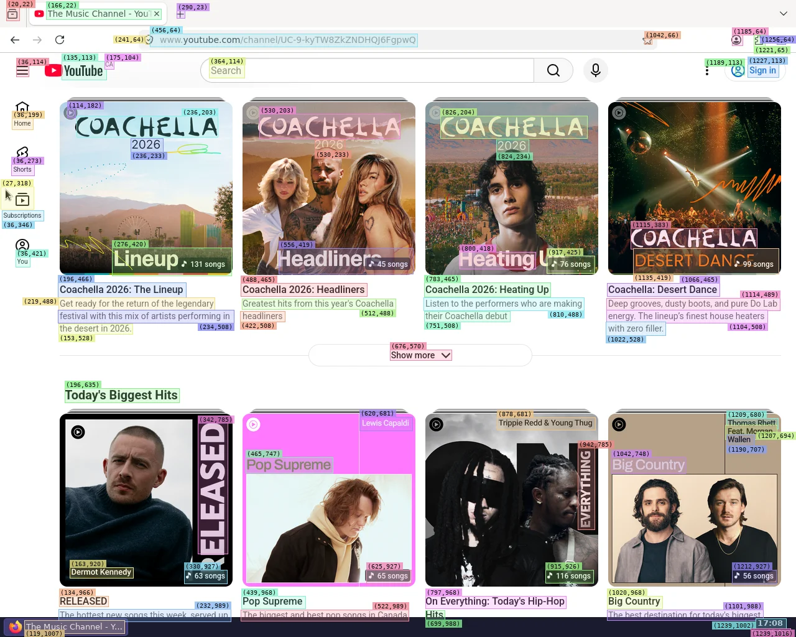

<p align="center">
  
</p>

<p align="center">
  
  
  
  
</p>

<p align="center">
  <strong>Give your AI agent eyes, hands, and a full Linux desktop.</strong><br>
  An MCP server that lets LLM agents see the screen, move the mouse, type on the keyboard, launch apps, and run shell commands — all inside a sandboxed virtual desktop.
</p>

<p align="center">
  <em>If a human can do it on a desktop, your agent can too.</em>
</p>

<p align="center">
  
</p>

---

## Why GhostDesk?

Most AI agents are trapped in text. They can call APIs and generate code, but they can't **use software**. GhostDesk changes that.

Connect any MCP-compatible LLM (Claude, GPT, Gemini...) and it gets a full Linux desktop with 11 tools to interact with **any application** — browsers, IDEs, office suites, terminals, legacy software, internal tools. No API needed. No integration required. If it has a UI, your agent can use it.

### Agentic workflows — chain anything

```
"Go to the CRM, export last month's leads as CSV,
 open LibreOffice Calc, build a pivot table,
 take a screenshot of the chart, and email it to the team."
```

Your agent opens the browser, logs in, downloads the file, switches to another app, processes the data, captures the result, and sends it — autonomously, across multiple applications, in one conversation.

### Browse the web like a human

```
"Search for competitors on Google, open the first 5 results,
 extract pricing from each page, and summarize in a spreadsheet."
```

No Selenium. No CSS selectors. No Puppeteer scripts that break every week. The agent looks at the screen, clicks what it sees, fills forms naturally — with human-like mouse movement that bypasses bot detection.

### Operate any software — no API required

```
"Open the legacy inventory app, search for product #4521,
 update the stock count to 150, and confirm the change."
```

That old Java app with no API? That internal admin panel from 2010? A Windows app running in Wine? If it renders pixels on screen, your agent can operate it.

### See it in action

| Demo | Description |
|------|-------------|
| [Amazon Scraper to Google Sheets](demos/gifs/ghostdesk-amazon-sheets-automation.gif) | AI agent scrapes Amazon laptops, extracts product data, populates Google Sheets, and visualizes with charts |
| [Flight Search & Comparison](demos/gifs/ghostdesk-flight-search.gif) | AI agent searches Google Flights for Paris CDG → New York JFK, compares prices, and builds a chart in LibreOffice Calc |

---

## From one agent to a workforce

Each GhostDesk instance is a container. Spin up one, ten, or a hundred — each agent gets its own isolated desktop, its own apps, its own role. Think of it as hiring a team of digital employees, each with their own workstation.

### Scale horizontally

```yaml
# docker-compose.yml — 3 specialized agents, one command
services:
  sales-agent:
    image: ghcr.io/yv17labs/ghostdesk:latest
    container_name: ghostdesk-sales-agent
    ports: ["3001:3000", "6081:6080"]
    volumes: ["ghostdesk-sales-agent-home:/home/agent"]
    shm_size: 2g
    environment:
      - VNC_PASSWORD=changeme
      - TZ=America/New_York
      - LOCALE=en_US.utf8

  research-agent:
    image: ghcr.io/yv17labs/ghostdesk:latest
    container_name: ghostdesk-research-agent
    ports: ["3002:3000", "6082:6080"]
    volumes: ["ghostdesk-research-agent-home:/home/agent"]
    shm_size: 2g
    environment:
      - VNC_PASSWORD=changeme
      - TZ=America/Toronto
      - LOCALE=en_CA.utf8

  accounting-agent:
    image: ghcr.io/yv17labs/ghostdesk:latest
    container_name: ghostdesk-accounting-agent
    ports: ["3003:3000", "6083:6080"]
    volumes: ["ghostdesk-accounting-agent-home:/home/agent"]
    shm_size: 2g
    environment:
      - VNC_PASSWORD=changeme
      - TZ=Europe/Paris
      - LOCALE=fr_FR.utf8

volumes:
  ghostdesk-sales-agent-home:
  ghostdesk-research-agent-home:
  ghostdesk-accounting-agent-home:
```

```bash
docker compose up -d   # Your workforce is ready
```

Each agent runs in parallel, independently, on its own desktop. Connect each to a different LLM, give each a different system prompt, install different apps — full specialization.

### Secure by design

Every agent is sandboxed in its own container. No access to the host machine. No access to other agents. Network, filesystem, and process isolation come free from Docker.

This makes GhostDesk a natural fit for enterprises:

| Concern | How GhostDesk handles it |
|---------|--------------------------|
| **Data isolation** | Each agent lives in its own container — no shared filesystem, no shared memory |
| **Access control** | Restrict network access per agent with Docker networking. An agent with CRM access doesn't see finance tools |
| **Auditability** | Watch any agent live via VNC, record sessions, review screenshots |
| **Blast radius** | If an agent goes wrong, kill the container. Nothing else is affected |
| **Compliance** | No data touches your host. Containers can run in air-gapped environments |

### Specialize each agent

Give each agent a role, like you would a new hire:

- **Sales agent** — monitors the CRM, enriches leads, updates the pipeline
- **Research agent** — browses the web, compiles competitive intelligence, writes reports
- **Accounting agent** — processes invoices in legacy ERP software, reconciles spreadsheets
- **QA agent** — clicks through your app, files bug reports with screenshots
- **Support agent** — handles tickets, looks up customer info across multiple internal tools

Each agent gets its own system prompt defining its mission, its own installed applications, and its own network permissions. Manage AI agents like employees — each with their own desktop, their own tools, and their own clearance level.

### Supervise in real time

Every agent exposes a VNC/noVNC endpoint. Open a browser tab and watch your agent work — or open ten tabs and monitor your entire workforce. Intervene at any time: take over the mouse, correct course, or chat with the orchestrating LLM.

---

## How it works

GhostDesk runs a virtual Linux desktop inside Docker and exposes it as an MCP server. Your agent gets a sandboxed desktop with a taskbar, clock, and pre-installed applications — equivalent to what a human sees on their screen.

The agent perceives the screen in two ways:

### Vision mode — `screenshot()` / `screenshot(overlay=True)`

The agent takes a screenshot to see the screen. Every screenshot also returns detected UI elements with absolute `(x, y)` coordinates as structured JSON — the agent reads coordinates from the JSON and clicks directly. With `overlay=True`, colored boxes with coordinate labels are drawn on the image for visual reference.

<p align="center">
  
  <br><em>Raw screenshot — the agent sees the screen exactly as a human would.</em>
</p>

<p align="center">
  
  <br><em>Overlay mode — every element gets a colored box with (x, y) coordinates for visual reference.</em>
</p>

### Lightweight mode — `inspect()`

`inspect()` is a text-only alternative to `screenshot()` — it returns the same JSON metadata (screen, cursor, windows, elements) without the image, saving context tokens. Use it when the agent doesn't need to see the screen.

```json
{
  "screen": {"width": 1280, "height": 1024},
  "region": {"x": 0, "y": 0, "width": 1280, "height": 1024},
  "cursor": {"x": 17, "y": 60},
  "windows": [
    {"app": "firefox", "title": "YouTube — Mozilla Firefox", "x": 0, "y": 0, "width": 1280, "height": 992}
  ],
  "elements": [
    {"label": "Search", "x": 364, "y": 114, "width": 42, "height": 14},
    {"label": "Sign in", "x": 1227, "y": 113, "width": 38, "height": 13},
    {"label": "Home", "x": 36, "y": 200, "width": 32, "height": 14},
    {"label": "Shorts", "x": 36, "y": 273, "width": 36, "height": 14}
  ]
}
```

Then the agent acts — clicks, types, scrolls, or runs commands using human-like input simulation (Bézier mouse curves, variable typing delays, micro-jitter) — and verifies the result.

This approach works with **any application** — web apps, native apps, legacy software, Canvas, WebGL. If it renders pixels, the agent can use it.

---

## Quick start

### 1. Run the container

```bash
docker run -d --name ghostdesk-my-agent \
  -p 3000:3000 \
  -p 5900:5900 \
  -p 6080:6080 \
  -v ghostdesk-my-agent-home:/home/agent \
  --shm-size 2g \
  -e VNC_PASSWORD=changeme \
  -e TZ=UTC \
  -e LOCALE=en_US.utf8 \
  ghcr.io/yv17labs/ghostdesk:latest
```

Replace `my-agent` with whatever name fits your use case — `sales-agent`, `research-agent`, `accounting-agent`…

The named volume persists the agent's home directory across restarts — browser passwords, bookmarks, cookies, downloads, and desktop preferences are all preserved. On the first run, Docker automatically seeds the volume with the default configuration from the image.

### 2. Connect your AI

GhostDesk works with any MCP-compatible client. Add it to your config:

**Claude Desktop / Claude Code** (Streamable HTTP)
```json
{
  "mcpServers": {
    "ghostdesk": {
      "type": "http",
      "url": "http://localhost:3000/mcp"
    }
  }
}
```

**ChatGPT, Gemini, or any LLM with MCP support** — same config, just point to `http://localhost:3000/mcp`.

### 3. Watch your agent work

Open `http://localhost:6080/vnc.html` in your browser to see the virtual desktop in real time.

| Service | URL |
|---------|-----|
| MCP server | `http://localhost:3000/mcp` |
| noVNC (browser) | `http://localhost:6080/vnc.html` |
| VNC | `vnc://localhost:5900` (password: `changeme`) |

---

## Tools

11 tools at your agent's fingertips:

### Screen
| Tool | Description |
|------|-------------|
| `screenshot` | Capture the screen as an image + detected elements with absolute coordinates. One call gives vision and click targets. Use `overlay=True` to draw bounding boxes |
| `inspect` | Text-only alternative to `screenshot()` — same JSON metadata, no image. Saves context tokens |

### Mouse & keyboard
| Tool | Description |
|------|-------------|
| `mouse_click` | Click at coordinates |
| `mouse_double_click` | Double-click at coordinates |
| `mouse_drag` | Drag from one position to another |
| `mouse_scroll` | Scroll in any direction (up/down/left/right) |
| `type_text` | Type with realistic per-character delays |
| `press_key` | Press keys or combos (`ctrl+c`, `alt+F4`, `Return`...) |

### System
| Tool | Description |
|------|-------------|
| `launch` | Start GUI applications |
| `get_clipboard` | Read clipboard contents |
| `set_clipboard` | Write to clipboard |

---

## Model requirements

GhostDesk works best with models that have both **vision and tool use**. The MCP server includes built-in instructions that guide the agent on how to use the tools effectively.

Works well with large models out of the box (Claude, GPT-4, Gemini). Best results with **Anthropic models** — all tiers including Haiku perform reliably.

**Best small model tested to date:** [Qwen3.5-35B-A3B](https://huggingface.co/Qwen/Qwen3.5-35B-A3B) — a 35B MoE model with only 3B active parameters. Recommended as a starting point for local deployments. Below this size, results are possible but unreliable.

---

## Configuration

| Variable | Default | Description |
|----------|---------|-------------|
| `SCREEN_WIDTH` | `1280` | Virtual screen width |
| `SCREEN_HEIGHT` | `1024` | Virtual screen height |
| `VNC_PASSWORD` | `changeme` | VNC access password |
| `PORT` | `3000` | MCP server port |
| `TZ` | `UTC` | Timezone (e.g. `Europe/Paris`, `America/Toronto`) |
| `LOCALE` | `en_US.utf8` | System locale (e.g. `fr_FR.utf8`, `fr_CA.utf8`) |

---

## Tests

```bash
uv run pytest --cov
```

---

## License

AGPL-3.0 with Commons Clause — see [LICENSE](LICENSE).

Commercial use (resale, paid SaaS, etc.) requires written permission from the project owner.
