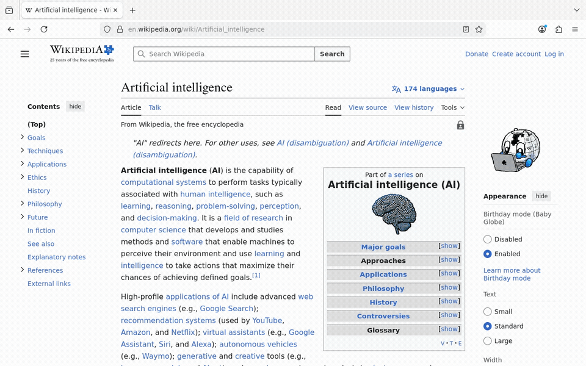

<p align="center">
  
  
  
  
  
</p>

<h1 align="center">GhostDesk</h1>

<p align="center">
  <strong>Give your AI agent eyes, hands, and a full Linux desktop.</strong><br>
  An MCP server that lets LLM agents see the screen, move the mouse, type on the keyboard, read UI elements, fill forms, launch apps, and run shell commands — all inside a sandboxed virtual desktop.
</p>

<p align="center">
  <em>If a human can do it on a desktop, your agent can too.</em>
</p>

<p align="center">
  
</p>

---

## Why GhostDesk?

Most AI agents are trapped in text. They can call APIs and generate code, but they can't **use software**. GhostDesk changes that.

Connect any MCP-compatible LLM (Claude, GPT, Gemini...) and it gets a full Linux desktop with 25+ tools to interact with **any application** — browsers, IDEs, office suites, terminals, legacy software, internal tools. No API needed. No integration required. If it has a UI, your agent can use it.

## What can your agent do with a full desktop?

Your agent gets its own Linux desktop. Here's what that unlocks:

### Agentic workflows — chain anything

```
"Go to the CRM, export last month's leads as CSV,
 open LibreOffice Calc, build a pivot table,
 take a screenshot of the chart, and email it to the team."
```

Your agent opens the browser, logs in, downloads the file, switches to another app, processes the data, captures the result, and sends it — autonomously, across multiple applications, in one conversation.

### Browse the web like a human

```
"Search for competitors on Google, open the first 5 results,
 extract pricing from each page, and summarize in a spreadsheet."
```

No Selenium. No CSS selectors. No Puppeteer scripts that break every week. The agent reads the page semantically, clicks what it sees, fills forms naturally — and falls back to human-like mouse movement when sites detect bots.

### Operate any software — no API required

```
"Open the legacy inventory app, search for product #4521,
 update the stock count to 150, and confirm the change."
```

That old Java app with no API? That internal admin panel from 2010? A Windows app running in Wine? If it renders pixels on screen, your agent can operate it.

### Data extraction at scale

```
"Open the analytics dashboard, read the KPI table,
 scroll down to the revenue chart, take a screenshot,
 then export the raw data."
```

The accessibility engine returns structured tables (headers + rows), form values, and element states — not raw pixels. Your agent reads UIs like a screen reader, fast and accurate.

### QA & UI testing with evidence

```
"Navigate the signup flow, try invalid emails, empty fields,
 and SQL injection in every input. Screenshot each error state."
```

Your agent becomes a QA engineer — it clicks every button, fills every form, tests every edge case, and brings back screenshots as proof.

### Unattended automation — runs 24/7

```
"Every morning: log into the supplier portal, download
 the latest price list, compare with yesterday's, and
 flag any changes above 5%."
```

Runs headless in Docker. No physical screen. No human babysitting. Schedule your agent to handle repetitive desktop tasks while you sleep.

### Multi-app orchestration

```
"Open VS Code, create a new Python file, write a script
 that calls our API, run it in the terminal, debug if it fails,
 then commit and push to GitHub."
```

Your agent isn't limited to one app. It can switch between browser, terminal, IDE, file manager, email client — just like a human switching windows on their desktop.

## Key features

| | Feature | Why it matters |
|---|---|---|
| **👁️** | **Accessibility engine** | Reads UI elements semantically (buttons, inputs, labels, tables) — fast, structured, zero vision cost |
| **🖱️** | **Human-like input** | Bézier mouse curves, variable typing speed, micro-jitter — bypasses bot detection |
| **📸** | **Screenshots** | Full or regional captures with cursor overlay — for when your agent needs to *see* |
| **📋** | **Clipboard** | Read & write the clipboard — paste long text instantly |
| **⌨️** | **Keyboard control** | Type text, press hotkeys, keyboard shortcuts — full keyboard access |
| **🖥️** | **Shell access** | Run any command, launch any app, capture stdout/stderr |
| **📊** | **Table extraction** | Pull structured table data (headers + rows) from any application |
| **🔍** | **Smart element detection** | Wait for elements to appear, scroll them into view, inspect their state |
| **🐳** | **Sandboxed** | Runs in Docker — isolated, reproducible, safe |
| **👀** | **Live view** | Watch your agent work in real-time via VNC or browser (noVNC) |

## 25+ tools at your agent's fingertips

### Read & understand the screen
| Tool | Description |
|------|-------------|
| `read_screen()` | Get all visible UI elements — names, roles, states — in reading order |
| `get_element_details()` | Inspect any element: its value, actions, children, position |
| `read_table()` | Extract structured table data as headers + rows |
| `screenshot()` | Capture the screen (full or region) with cursor position overlay |
| `get_screen_size()` | Get current screen resolution |

### Interact with the UI
| Tool | Description |
|------|-------------|
| `click_element()` | Find an element by name and click it |
| `set_value()` | Set text, numbers, or slider values on form fields |
| `focus_element()` | Give keyboard focus to any element |
| `scroll_to_element()` | Scroll an off-screen element into view |
| `wait_for_element()` | Wait until an element appears (with configurable timeout) |

### Mouse & keyboard
| Tool | Description |
|------|-------------|
| `mouse_move()` | Move the cursor with natural Bézier trajectories |
| `mouse_click()` | Click at coordinates (left / middle / right) |
| `mouse_double_click()` | Double-click at coordinates |
| `mouse_drag()` | Drag with human-like movement |
| `mouse_scroll()` | Scroll in any direction |
| `type_text()` | Type with realistic per-character delays |
| `press_key()` | Press keys or combos (`ctrl+c`, `alt+F4`, `Return`...) |

### System
| Tool | Description |
|------|-------------|
| `exec()` | Run shell commands with stdout/stderr capture |
| `launch()` | Start GUI applications |
| `wait()` | Pause execution |
| `get_clipboard()` | Read clipboard contents |
| `set_clipboard()` | Write to clipboard |

## Quick start

### 1. Run the container

```bash
docker run -d --name ghostdesk \
  -p 3000:3000 \
  -p 5900:5900 \
  -p 6080:6080 \
  ghcr.io/yv17labs/ghostdesk:latest
```

That's it. The virtual desktop, MCP server, and VNC are all running inside an isolated container. Your agent gets a full Linux desktop — your host machine stays untouched.

### 2. Connect your AI

GhostDesk works with any MCP-compatible client. Add it to your config:

**Claude Desktop / Claude Code**
```json
{
  "mcpServers": {
    "ghostdesk": {
      "type": "http",
      "url": "http://localhost:3000/mcp"
    }
  }
}
```

**ChatGPT, Gemini, or any LLM with MCP support** — same config, just point to `http://localhost:3000/mcp`.

**Local models (Ollama, LM Studio, etc.)** — any MCP client library can connect to the same endpoint.

### 3. Watch your agent work

Open `http://localhost:6080/vnc.html` in your browser to see the virtual desktop in real time.

| Service | URL |
|---------|-----|
| MCP server | `http://localhost:3000/mcp` |
| noVNC (browser) | `http://localhost:6080/vnc.html` |
| VNC | `vnc://localhost:5900` (password: `changeme`) |

## How it works

GhostDesk uses **two interaction channels** that your agent switches between automatically:

**Accessibility channel** — Uses Linux's AT-SPI (the same API screen readers use) to read and interact with UI elements. Fast, structured, no screenshots needed. Perfect for forms, buttons, menus, and tables.

**Devices channel** — Simulates real mouse and keyboard input with human-like behavior: Bézier curves for mouse movement, variable typing delays, micro-jitter on click targets. Indistinguishable from a real user. Used when accessibility isn't enough — canvas apps, CAPTCHAs, visual verification.

Your agent starts with accessibility (fast & cheap), and falls back to devices (stealth & visual) only when needed.

## Configuration

| Variable | Default | Description |
|----------|---------|-------------|
| `SCREEN_WIDTH` | `1280` | Virtual screen width |
| `SCREEN_HEIGHT` | `800` | Virtual screen height |
| `SCREEN_DEPTH` | `24` | Color depth |
| `VNC_PASSWORD` | `changeme` | VNC access password |
| `PORT` | `3000` | MCP server port |

## Tests

```bash
uv run pytest --cov
```

183 tests — 97% coverage.

## License

MIT — see [LICENSE](LICENSE).
