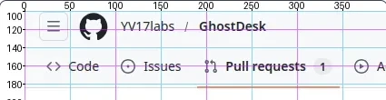

<p align="center">
  
</p>

<p align="center">
  
  
  
  
</p>

<p align="center">
  <strong>Give your AI agent eyes, hands, and a full Linux desktop.</strong><br>
  An MCP server that lets LLM agents see the screen, move the mouse, type on the keyboard, launch apps, and run shell commands — all inside a sandboxed virtual desktop.
</p>

<p align="center">
  <em>If a human can do it on a desktop, your agent can too.</em>
</p>

<p align="center">
  
</p>

---

## Why GhostDesk?

Most AI agents are trapped in text. They can call APIs and generate code, but they can't **use software**. GhostDesk changes that.

Connect any MCP-compatible LLM (Claude, GPT, Gemini...) and it gets a full Linux desktop with 11 tools to interact with **any application** — browsers, IDEs, office suites, terminals, legacy software, internal tools. No API needed. No integration required. If it has a UI, your agent can use it.

### Agentic workflows — chain anything

```
"Go to the CRM, export last month's leads as CSV,
 open LibreOffice Calc, build a pivot table,
 take a screenshot of the chart, and email it to the team."
```

Your agent opens the browser, logs in, downloads the file, switches to another app, processes the data, captures the result, and sends it — autonomously, across multiple applications, in one conversation.

### Browse the web like a human

```
"Search for competitors on Google, open the first 5 results,
 extract pricing from each page, and summarize in a spreadsheet."
```

No Selenium. No CSS selectors. No Puppeteer scripts that break every week. The agent looks at the screen, clicks what it sees, fills forms naturally — with human-like mouse movement that bypasses bot detection.

### Operate any software — no API required

```
"Open the legacy inventory app, search for product #4521,
 update the stock count to 150, and confirm the change."
```

That old Java app with no API? That internal admin panel from 2010? A Windows app running in Wine? If it renders pixels on screen, your agent can operate it.

### See it in action

| Demo | Description |
|------|-------------|
| [Amazon Scraper to Google Sheets](demos/gifs/ghostdesk-amazon-sheets-automation.gif) | AI agent scrapes Amazon laptops, extracts product data, populates Google Sheets, and visualizes with charts |
| [Flight Search & Comparison](demos/gifs/ghostdesk-flight-search.gif) | AI agent searches Google Flights for Paris CDG → New York JFK, compares prices, and builds a chart in LibreOffice Calc |

---

## From one agent to a workforce

Each GhostDesk instance is a container. Spin up one, ten, or a hundred — each agent gets its own isolated desktop, its own apps, its own role. Think of it as hiring a team of digital employees, each with their own workstation.

### Scale horizontally

```yaml
# docker-compose.yml — 3 specialized agents, one command
#
# Secrets come from a .env file (git-ignored) or your secret manager. On
# Kubernetes, wire them from a Secret via `valueFrom.secretKeyRef`. See
# SECURITY.md for the full secret-handling contract.
services:
  sales-agent:
    image: ghcr.io/yv17labs/ghostdesk:latest
    container_name: ghostdesk-sales-agent
    restart: unless-stopped
    cap_add: [SYS_ADMIN]
    ports: ["3001:3000", "6081:6080"]
    volumes:
      - ghostdesk-sales-agent-home:/home/agent
    shm_size: 2g
    environment:
      - GHOSTDESK_AUTH_TOKEN
      - GHOSTDESK_VNC_PASSWORD
      - TZ=America/New_York
      - LANG=en_US.UTF-8

  research-agent:
    image: ghcr.io/yv17labs/ghostdesk:latest
    container_name: ghostdesk-research-agent
    restart: unless-stopped
    cap_add: [SYS_ADMIN]
    ports: ["3002:3000", "6082:6080"]
    volumes:
      - ghostdesk-research-agent-home:/home/agent
    shm_size: 2g
    environment:
      - GHOSTDESK_AUTH_TOKEN
      - GHOSTDESK_VNC_PASSWORD
      - TZ=America/Toronto
      - LANG=en_CA.UTF-8

  accounting-agent:
    image: ghcr.io/yv17labs/ghostdesk:latest
    container_name: ghostdesk-accounting-agent
    restart: unless-stopped
    cap_add: [SYS_ADMIN]
    ports: ["3003:3000", "6083:6080"]
    volumes:
      - ghostdesk-accounting-agent-home:/home/agent
    shm_size: 2g
    environment:
      - GHOSTDESK_AUTH_TOKEN
      - GHOSTDESK_VNC_PASSWORD
      - TZ=Europe/Paris
      - LANG=fr_FR.UTF-8

volumes:
  ghostdesk-sales-agent-home:
  ghostdesk-research-agent-home:
  ghostdesk-accounting-agent-home:
```

```bash
docker compose up -d   # Your workforce is ready
```

Each agent runs in parallel, independently, on its own desktop. Connect each to a different LLM, give each a different system prompt, install different apps — full specialization.

### Secure by design

Every agent is sandboxed in its own container. No access to the host machine. No access to other agents. Network, filesystem, and process isolation come free from Docker.

This makes GhostDesk a natural fit for enterprises:

| Concern | How GhostDesk handles it |
|---------|--------------------------|
| **Data isolation** | Each agent lives in its own container — no shared filesystem, no shared memory |
| **Access control** | Restrict network access per agent with Docker networking. An agent with CRM access doesn't see finance tools |
| **Auditability** | Watch any agent live via VNC, record sessions, review screenshots |
| **Blast radius** | If an agent goes wrong, kill the container. Nothing else is affected |
| **Compliance** | No data touches your host. Containers can run in air-gapped environments |

### Specialize each agent

Give each agent a role, like you would a new hire:

- **Sales agent** — monitors the CRM, enriches leads, updates the pipeline
- **Research agent** — browses the web, compiles competitive intelligence, writes reports
- **Accounting agent** — processes invoices in legacy ERP software, reconciles spreadsheets
- **QA agent** — clicks through your app, files bug reports with screenshots
- **Support agent** — handles tickets, looks up customer info across multiple internal tools

Each agent gets its own system prompt defining its mission, its own installed applications, and its own network permissions. Manage AI agents like employees — each with their own desktop, their own tools, and their own clearance level.

### Supervise in real time

Every agent exposes a VNC/noVNC endpoint. Open a browser tab and watch your agent work — or open ten tabs and monitor your entire workforce. Intervene at any time: take over the mouse, correct course, or chat with the orchestrating LLM.

---

## How it works

GhostDesk runs a virtual Linux desktop inside Docker and exposes it as an MCP server. Your agent gets a sandboxed desktop with a taskbar, clock, and pre-installed applications — equivalent to what a human sees on their screen.

The agent perceives the screen and locates click targets with:

### Vision mode — `screenshot()` with region cropping

The agent takes a screenshot to see the screen. For precise clicking, it crops to a sub-rectangle by passing `region=` to `screenshot()` and reads coordinates directly from the cropped image. The crop is taken at native screen resolution — pixels are not enlarged, the agent simply receives fewer of them with no visual distractors.

Smaller vision models that struggle to count pixels can additionally pass `grid=True` **together with a `region=` crop** to get a coordinate ruler drawn in margins around the image (X axis labeled every 50 px along the top, Y axis every 20 px along the left, with thin alternating gridlines over the content). Ruler values are absolute screen coordinates, so the agent reads the click point directly off the rulers instead of estimating offsets.

Then the agent acts — clicks, types, scrolls, or runs commands using human-like input simulation (Bézier mouse curves, variable typing delays, micro-jitter) — and verifies the result.

This approach works with **any application** — web apps, native apps, legacy software, Canvas, WebGL. If it renders pixels, the agent can use it.

---

## Quick start

### 1. Run the container

GhostDesk refuses to boot without an MCP auth token and a VNC password. For a local spin-up, generate both and pass them inline:

```bash
export GHOSTDESK_AUTH_TOKEN=$(openssl rand -hex 32)
export GHOSTDESK_VNC_PASSWORD=$(openssl rand -hex 16)

docker run -d --name ghostdesk-my-agent \
  --restart unless-stopped \
  --cap-add SYS_ADMIN \
  -p 3000:3000 \
  -p 6080:6080 \
  -v ghostdesk-my-agent-home:/home/agent \
  --shm-size 2g \
  -e GHOSTDESK_AUTH_TOKEN \
  -e GHOSTDESK_VNC_PASSWORD \
  -e TZ=UTC \
  -e LANG=en_US.UTF-8 \
  ghcr.io/yv17labs/ghostdesk:latest

echo "MCP token:    $GHOSTDESK_AUTH_TOKEN"
echo "VNC password: $GHOSTDESK_VNC_PASSWORD"
```

Replace `my-agent` with whatever name fits your use case — `sales-agent`, `research-agent`, `accounting-agent`…

> **In production, inject both secrets from your secret manager.** On Kubernetes, use `valueFrom.secretKeyRef`; with Docker / compose, use a `.env` file backed by Docker secrets, Vault, AWS Secrets Manager, etc. See [Security](#security) for the full contract.

> **`--cap-add SYS_ADMIN`** — Required by Electron apps (VS Code, Slack, etc.) and other applications that need Linux user namespaces to run their sandbox. Safe to remove if you don't need them.

> **noVNC front-door authentication is still the operator's job.** The in-container VNC password is defense in depth — production deployments should also sit behind a reverse proxy / identity-aware proxy that terminates TLS and gates access to port 6080. See [Security](#security).

The named volume persists the agent's home directory across restarts — browser passwords, bookmarks, cookies, downloads, and desktop preferences are all preserved. On the first run, Docker automatically seeds the volume with the default configuration from the image.

### 2. Connect your AI

GhostDesk works with any MCP-compatible client. Add it to your config:

**Claude Desktop / Claude Code** (Streamable HTTP)
```json
{
  "mcpServers": {
    "ghostdesk": {
      "type": "http",
      "url": "http://localhost:3000/mcp",
      "headers": {
        "Authorization": "Bearer <your GHOSTDESK_AUTH_TOKEN>"
      }
    }
  }
}
```

**ChatGPT, Gemini, or any LLM with MCP support** — same config, same bearer token header.

### 3. Watch your agent work

Open `http://localhost:6080/vnc.html` in your browser to see the virtual desktop in real time. In production, terminate TLS on a reverse proxy in front of the container — or mount a cert at `/etc/ghostdesk/tls/server.{crt,key}` to let `websockify` and the MCP server serve HTTPS directly. For a locally-trusted dev cert, use [`mkcert`](https://github.com/FiloSottile/mkcert) (see [Security](#security) → Transport Security → Dev mode). GhostDesk does not generate a self-signed cert on your behalf.

| Service | URL |
|---------|-----|
| MCP server | `http://localhost:3000/mcp` (behind a reverse proxy in production — see [Security](#security)) |
| noVNC (browser) | `http://localhost:6080/vnc.html` (username `agent`, password: `$GHOSTDESK_VNC_PASSWORD`) |
| VNC (loopback only — bound to `127.0.0.1` inside the container) | — |

---

## Tools

12 tools at your agent's fingertips, grouped by concern (`verb_noun` naming):

### Screen
| Tool | Description |
|------|-------------|
| `screen_shot` | Capture the screen as a WebP image (pass `format="png"` for lossless). Pass `region=` to crop to a sub-rectangle at native resolution. Pass `grid=True` to overlay a coordinate ruler in margins around the image (absolute screen coordinates, works with `region=` too). Set `stabilize=False` to skip page stabilization checks (default: True, waits max 5 sec for page to stabilize) |

### Mouse
| Tool | Description |
|------|-------------|
| `mouse_click` | Click at coordinates |
| `mouse_double_click` | Double-click at coordinates |
| `mouse_drag` | Drag from one position to another |
| `mouse_scroll` | Scroll in any direction (up/down/left/right) |

### Keyboard
| Tool | Description |
|------|-------------|
| `key_type` | Type text with realistic per-character delays |
| `key_press` | Press keys or combos (`ctrl+c`, `alt+F4`, `Return`...) |

### Clipboard
| Tool | Description |
|------|-------------|
| `clipboard_get` | Read clipboard contents |
| `clipboard_set` | Write to clipboard |

### Apps
| Tool | Description |
|------|-------------|
| `app_list` | List the GUI applications installed on the desktop |
| `app_launch` | Start a GUI application by name |
| `app_status` | Check if an application is running and read its logs |

---

## Model requirements

GhostDesk works best with models that have both **vision and tool use**. The MCP server includes built-in instructions that guide the agent on how to use the tools effectively.

Works well with large models out of the box (Claude, GPT-4, Gemini). Best results with **Anthropic models** — all tiers including Haiku perform reliably.

### Small and medium models

Small and medium models require the same **vision and tool use** capabilities as larger models, but with simplified guidance to work within tighter reasoning and perception budgets. Use [SYSTEM_PROMPT.md](SYSTEM_PROMPT.md) as your system prompt — it trades flexibility for reliability, emphasizing critical rules (crop with grid before every click, use keyboard first) and explicit coordinate reading.

The grid overlay shows exact absolute screen coordinates so the model reads them directly instead of estimating:



### Running locally

**Inference server.** We do **not** recommend LM Studio: it's closed-source proprietary software with long-standing bugs that never get fixed, and crucially it does **not handle WebP images** — which is the format GhostDesk returns by default to keep payloads small.

Instead, use our fork of llama.cpp with WebP support: [YV17labs/llama.cpp](https://github.com/YV17labs/llama.cpp). The day WebP support lands upstream, we'll archive the fork and point here directly.

**Recommended models.** What matters here isn't raw intelligence but **speed** — desktop control needs fast keyboard/mouse interactions, so low-activation MoE models shine on modest hardware:

- [Qwen3.5-35B-A3B](https://huggingface.co/Qwen/Qwen3.5-35B-A3B) — 35B parameters, only 3B active per token.

Below these sizes, results are possible but unreliable. For these constraints, follow [SYSTEM_PROMPT.md](SYSTEM_PROMPT.md) for best results.

---

## Configuration

Every variable GhostDesk reads is namespaced under `GHOSTDESK_*`. Standard POSIX variables (`TZ`, `LANG`) are kept as-is so the existing Unix ecosystem keeps working.

### Secrets (required — container refuses to boot without them)

| Variable | Description |
|----------|-------------|
| `GHOSTDESK_AUTH_TOKEN` | Bearer token required on every MCP request. Generate with `openssl rand -hex 32`. |
| `GHOSTDESK_VNC_PASSWORD` | Password for wayvnc (username is `agent` in the prod image). Generate with `openssl rand -hex 16`. |

Both are plain environment variables — on Kubernetes wire them from a `Secret` via `valueFrom.secretKeyRef`; on Docker / compose inject them via `environment:` backed by Docker secrets or your secret manager. A front-door reverse proxy / identity-aware proxy in front of port 6080 is still recommended in production (the in-container VNC password is defense in depth) — see [Security](#security).

### Runtime knobs

| Variable | Default | Description |
|----------|---------|-------------|
| `GHOSTDESK_PORT` | `3000` | MCP server listening port |
| `GHOSTDESK_VNC_ADDRESS` | `127.0.0.1` | Address wayvnc binds on. Default is loopback-only (the VNC port is reachable only via the noVNC bridge on 6080). Set to `0.0.0.0` to expose port 5900 for direct native VNC clients; RSA-AES + `GHOSTDESK_VNC_PASSWORD` then protect the wire end-to-end. See [Security](#security). |
| `GHOSTDESK_SCREEN_WIDTH` | `1280` | Virtual screen width in pixels |
| `GHOSTDESK_SCREEN_HEIGHT` | `1024` | Virtual screen height in pixels |
| `GHOSTDESK_MODEL_SPACE` | `1000` | LLM coordinate normalisation space (`0` disables, for Claude / GPT-4o native pixels; `1000` for Qwen-VL style normalised space) |
| `TZ` | `America/New_York` | IANA timezone (POSIX standard, e.g. `Europe/Paris`) |
| `LANG` | `en_US.UTF-8` | POSIX locale (e.g. `fr_FR.UTF-8`) |

---

## Security

GhostDesk ships hardened by default on the two axes where it is the product's own responsibility: **transport encryption** and **authentication**. Everything else (rate limiting, SSO, WAF, session recording, brute-force protection) is a reverse-proxy concern — GhostDesk is designed to run behind one, not directly on the internet.

### What the product guarantees

- **Operator-owned TLS, with an in-container fallback.** By default, `websockify` (port 6080) and the MCP server (port 3000) serve plain HTTP — TLS is expected to be terminated upstream (reverse proxy, cloud LB, devcontainer port forward). If the operator prefers in-container termination instead, mount a cert at `/etc/ghostdesk/tls/server.{crt,key}`; both services detect it at startup and switch to HTTPS / WSS automatically.
  ```yaml
  volumes:
    - /etc/letsencrypt/live/agent.example.com/fullchain.pem:/etc/ghostdesk/tls/server.crt:ro
    - /etc/letsencrypt/live/agent.example.com/privkey.pem:/etc/ghostdesk/tls/server.key:ro
  ```
- **wayvnc end-to-end RSA-AES + password auth, loopback by default.** `wayvnc` listens on `127.0.0.1:5900` out of the box and is not reachable from outside the container. Operators who need a native VNC client to connect directly to port 5900 (bypassing the browser / noVNC) can opt in with `GHOSTDESK_VNC_ADDRESS=0.0.0.0` and publish the port. In **both** configurations wayvnc is always configured with `enable_auth=true` + RSA-AES (RFB security type 129): RSA key exchange → AES-128 session encryption → username/password auth inside the encrypted channel — negotiated end-to-end between the VNC client and wayvnc (`websockify` is a transparent bridge, it does not terminate the RFB stream). `GHOSTDESK_VNC_PASSWORD` is mandatory whether the port is loopback or exposed.
- **Mandatory MCP authentication.** The MCP server refuses requests without a valid `Authorization: Bearer <GHOSTDESK_AUTH_TOKEN>` header.
- **Secrets as plain env vars, sourced from your secret store.** Both `GHOSTDESK_AUTH_TOKEN` and `GHOSTDESK_VNC_PASSWORD` are read from the process environment. On Kubernetes, wire them from a `Secret` via `valueFrom.secretKeyRef` (values never appear in `kubectl describe pod`); on Docker, inject via `environment:` backed by Docker secrets / Vault / AWS Secrets Manager. The container never bakes a secret into an image layer.

### What is explicitly *not* in scope

These belong to the operator's deployment topology, not to the container:

- **Rate limiting & brute-force protection** → reverse proxy (Traefik middleware, nginx `limit_req`, Cloudflare).
- **SSO / OIDC / MFA** → identity-aware proxy (oauth2-proxy, Cloudflare Access, Tailscale, Pomerium).
- **WAF / IP allow-listing** → edge.
- **Per-user identity / SSO on noVNC (port 6080)** → reverse proxy with OAuth2-proxy, Cloudflare Access, Tailscale ACLs, Pomerium, devcontainer port forward, etc. The in-container VNC password is a single shared credential — for per-user audit trail and revocation, gate port 6080 with an identity-aware proxy. See [SECURITY.md](SECURITY.md#the-novnc-deployment-contract).
- **Session recording & audit trail** → proxy access logs + wayvnc stderr shipped to your log collector.
- **Cert rotation & CA trust** → your PKI / cert-manager / Let's Encrypt automation.

This separation is deliberate and standard: the product handles crypto and authN, the infrastructure handles policy.

---

## Custom image

The `base` tag provides GhostDesk without any pre-installed GUI application — just the virtual desktop, VNC, and the MCP server. Use it to build your own image with only the tools you need:

```dockerfile
FROM ghcr.io/yv17labs/ghostdesk:base

RUN apt-get update \
    && apt-get install -y --no-install-recommends \
        chromium-browser \
        libreoffice-calc \
    && rm -rf /var/lib/apt/lists/*
```

```bash
docker build -t my-agent .
```

See the project's [Dockerfile](Dockerfile) for a complete example.

| Tag | Description |
|-----|-------------|
| `latest`, `X.Y.Z`, `X.Y` | Full image — includes Firefox, terminal, sudo |
| `base`, `base-X.Y.Z`, `base-X.Y` | Minimal image — no GUI app, meant to be extended |

---

## Tests

```bash
uv run pytest --cov
```

---

## License

AGPL-3.0 with Commons Clause — see [LICENSE](LICENSE).

Commercial use (resale, paid SaaS, etc.) requires written permission from the project owner.
