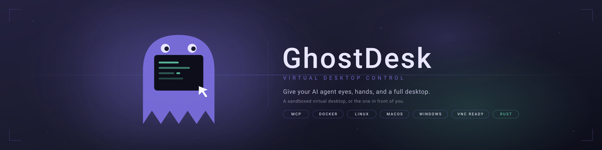

<p align="center">
  
</p>

<p align="center">
  
  
  
  
  
</p>

<p align="center">
  <strong>Give your AI agent eyes, hands, and a full desktop.</strong><br>
  An MCP server that lets LLM agents see the screen, move the mouse, type on the keyboard, launch apps, and run shell commands — in a sandboxed virtual desktop, or on the one in front of you.
</p>

<p align="center">
  <em>If a human can do it on a desktop, your agent can too.</em>
</p>

<p align="center">
  <video src="https://github.com/user-attachments/assets/304ba0b6-4ba8-49df-9825-a3bb78c2727e" controls muted playsinline width="960">
    Your browser does not support the video tag.
  </video>
</p>

<p align="center">
  <em>GhostDesk demo — from a single prompt (<strong>"open the browser, go to Google News, and tell me the latest headlines in the Technology section"</strong>), the agent launches Firefox, navigates to Google News, switches to the Technology section, and reports the latest stories back.</em>
</p>

---

**One binary, one MCP endpoint, three desktops.** The tool surface is the same
everywhere — an agent calls `mouse_click` and `app_launch` without knowing
which desktop it is on.

| | **Linux** | **macOS** | **Windows** |
|---|---|---|---|
| **How it runs** | the Docker container, in one command | a native binary | a native binary |
| **The desktop it drives** | a virtual one, shipped inside the image | the Mac in front of you | the PC in front of you |
| **Sandboxed** | yes — disposable, one per agent | no | no |
| **Driven through** | `zwlr_virtual_pointer_v1`, Sway IPC, `grim` | Quartz Event Services, Accessibility, `screencapture` | `SendInput`, GDI, `EnumWindows` |

**Linux is the server.** The container is the deployment this README shows
unless it says otherwise, and the only one of the three with a sandbox around
it. macOS and Windows run the very same server against a real desk — no
container, and therefore no isolation. Jump to
[macOS](#run-on-macos-without-the-container) or
[Windows](#run-on-windows-without-the-container), or read
[what differs](#what-differs-from-the-container) between the three.

<details>
<summary><strong>Table of contents</strong></summary>

- [Quick start](#quick-start)
- [Tools](#tools)
- [Model requirements](#model-requirements)
- [Why GhostDesk?](#why-ghostdesk)
- [How it works](#how-it-works)
- [Secure local run (TLS + auth)](#secure-local-run-tls--auth)
- [Running many agents](#running-many-agents)
- [Custom image](#custom-image)
- [Run on macOS, without the container](#run-on-macos-without-the-container)
- [Run on Windows, without the container](#run-on-windows-without-the-container)
- [What differs from the container](#what-differs-from-the-container)
- [Configuration](#configuration)
- [Security](#security)
- [Troubleshooting](#troubleshooting)
- [Build from source](#build-from-source)
- [License](#license)

</details>

---

## Quick start

### 1. Run the container

One command, plain HTTP, no password. Fine for kicking the tires on a laptop you trust — **not fit for anything beyond that**. Ready to harden it? Jump to [Secure local run](#secure-local-run-tls--auth).

```bash
docker run -d --name ghostdesk-demo \
  --shm-size 2g \
  -p 3000:3000 \
  -p 6080:6080 \
  ghcr.io/yv17labs/ghostdesk:latest
```

The `latest` image ships with **Firefox**, the **foot** terminal, **mousepad** (text editor), **galculator**, and passwordless `sudo` for the `agent` user — enough to demo a browsing + note-taking workflow out of the box. Need a different app set? Build your own on top of `base` — see [Custom image](#custom-image).

The container boots in the dev posture: plain HTTP on both ports, every auth gate disarmed on purpose. You'll see warnings in the logs reminding you of that — they go away once you follow the secured path below.

### 2. Connect your AI

GhostDesk speaks [MCP](https://modelcontextprotocol.io/) over the Streamable HTTP transport — any MCP-compatible client can drive it. Point your client at `http://localhost:3000/mcp`:

**Claude Desktop / Claude Code**
```json
{
  "mcpServers": {
    "ghostdesk": {
      "type": "http",
      "url": "http://localhost:3000/mcp"
    }
  }
}
```

**SpecterChat** — the chat client we build for this, open source: [YV17labs/SpecterChat](https://github.com/YV17labs/SpecterChat). Most chat UIs drop the image an MCP tool returns — they render it or they forward it to the model, rarely both — and a `screen_shot()` the model never sees is the whole product missing. SpecterChat displays it inline *and* sends it back as base64. It talks to any OpenAI-compatible endpoint (llama.cpp, vLLM, Ollama, LM Studio), so it pairs with the local stacks below; macOS, Linux and Windows builds are on its releases page.

**Any other MCP-compatible client** — same URL, no headers, no auth. That's the whole demo posture.

### 3. Watch your agent work

Open `http://localhost:6080/` in your browser to see the virtual desktop in real time. No password prompt — the dev posture skips it.

| Service | URL |
|---------|-----|
| MCP server | `http://localhost:3000/mcp` |
| noVNC (browser) | `http://localhost:6080/` |
| Health probes | `http://localhost:3000/health/{live,ready,startup}` |

The probes are what the container's `HEALTHCHECK` reads, and they answer about the desktop rather than about the processes: `ready` goes down when the compositor stops answering the window seam, `live` when the connection behind the virtual pointer and keyboard is gone — a state in which every tool still replies and none of them does anything.

Give your agent a first prompt to confirm the wiring is right:

> *"Take a screenshot of the desktop, list the installed applications, then open Firefox and go to wikipedia.org."*

You should see Firefox launch in the noVNC tab, the URL bar fill in, and the page load — all under your agent's control.

### 4. When you're done

```bash
docker stop ghostdesk-demo && docker rm ghostdesk-demo
```

The demo run creates no named volume, so this leaves nothing behind.

---

## Tools

Fourteen tools, named `verb_noun`, and this is the whole surface — no hidden
endpoint, no second protocol. Defaults are in parentheses, `?` marks an
optional parameter, and every coordinate is a **pixel offset in the last
`screen_shot()`**: the moment the screen changes, coordinates computed from the
previous capture are stale.

### Screen

| Tool | Parameters | Returns |
|---|---|---|
| `screen_shot` | `region?` — `{x, y, width, height}`, cropped at native resolution · `format` `"webp"` \| `"png"` (`webp`) · `stabilize` bool (`true`) — wait up to 5 s for the screen to settle · `quality` 1–100 (`50`, WebP only; raise it for fine fonts or design surfaces) | one image block — `{"type": "image", "data": "<base64>", "mimeType": "image/webp"}` |

### Mouse and keyboard

The seven input tools answer with the same verdict, and `screen_changed` is the
field worth branching on: `false` means the act landed on nothing. It is a
signal, not an error — the answer is a fresh capture, never a retry at the same
coordinates.

```json
{"action": "Clicked left at (612, 335)", "screen_changed": true, "reaction_time_ms": 180}
```

| Tool | Parameters |
|---|---|
| `mouse_move` | `x` int · `y` int |
| `mouse_click` | `x` · `y` · `button` `"left"` \| `"middle"` \| `"right"` (`left`) |
| `mouse_double_click` | `x` · `y` · `button` (`left`) |
| `mouse_drag` | `from_x` · `from_y` · `to_x` · `to_y` · `button` (`left`) |
| `mouse_scroll` | `x` · `y` · `direction` `"up"` \| `"down"` \| `"left"` \| `"right"` (`down`) · `amount` 1–5 wheel notches (`3`) |
| `key_type` | `text` string — Unicode, newlines and tabs, layout-independent |
| `key_press` | `keys` string — one chord, `+` between tokens. Modifiers: `ctrl`/`control`, `alt`/`option`, `shift`, `super`/`meta`/`win`/`cmd`/`command`. Named keys: `return`/`enter`, `escape`/`esc`, `backspace`, `delete`, `tab`, `space`, `home`/`end`, `pageup`/`pagedown`, `left`/`right`/`up`/`down`, `f1`–`f12` |

Past a sentence or two, `clipboard_set(text)` plus the paste chord beats
`key_type`: it is instant, and immune to autocomplete and to the app's own key
handlers.

### Clipboard

| Tool | Parameters | Returns |
|---|---|---|
| `clipboard_get` | — | the clipboard as text — an empty string when it is empty or holds something that is not text |
| `clipboard_set` | `text` string | `Clipboard set (N characters)` |

### Apps

| Tool | Parameters | Returns |
|---|---|---|
| `app_list` | — | `result[]`, one entry per installed app: `name`, `exec`. This is the launch whitelist, and `exec` is the exact string `app_launch` takes |
| `app_running` | — | `result[]`, one entry per real client window: `app`, `title`, `pid`, `focused` |
| `app_launch` | `command` string — an `exec` from `app_list`, arguments not accepted · `wait_for_window` bool (`true`) | `pid`, `log_file`, `action`, plus `window` and `window_wait_ms` once a window appeared — and **the settled screen as an image block**, so no follow-up `screen_shot()` is needed |
| `app_status` | `pid` int — one returned by `app_launch` · `lines` int (`50`) | `pid`, `running`, `log_file`, `tail` — the tail of the captured stdout/stderr |

`app_list` is a whitelist rather than a hint: `app_launch` refuses anything
outside it, arguments included, whatever name the model sends.

### On the wire

A call is ordinary MCP over Streamable HTTP — `POST /mcp`, whose `Accept`
header has to name **both** `application/json` and `text/event-stream` or the
endpoint answers `406`.

```jsonc
// the params of a tools/call request
{"name": "mouse_click", "arguments": {"x": 612, "y": 335}}
```

The result carries its payload twice — once in `structuredContent`, once as a
text block holding the same JSON, which is what a client older than structured
output reads. `screen_shot` is the exception and answers with an image block.

Two headers are GhostDesk's own: `Authorization: Bearer …`, required once a
cert is mounted ([Secure local run](#secure-local-run-tls--auth)), and
`GhostDesk-Model-Space`, for models that emit normalised coordinates ([Model
requirements](#model-requirements)).

---

## Model requirements

Your inference stack must cover four capabilities — all four are mandatory:

1. **Text + vision** — the agent perceives the desktop through screenshots and needs a model that can interpret them.
2. **Tool use** — GhostDesk exposes its tools as function calls; the model must be able to invoke them.
3. **MCP client** — the host needs to speak Streamable HTTP MCP to reach the GhostDesk server.
4. **WebP image support** — GhostDesk returns screenshots as WebP by default to keep payloads small and inference fast. A stack that can only decode PNG or JPEG will not work out of the box.

Points 3 and 4 are where most stacks fall short, and both halves have an answer here: [SpecterChat](https://github.com/YV17labs/SpecterChat) on the client side, and the llama.cpp forks below on the inference side.

### Coordinate space — `GhostDesk-Model-Space` header

By default no header is needed: Claude and the other major frontier LLMs work out of the box. **Qwen3.x** need the client to send `GhostDesk-Model-Space: 1000` on every MCP request.

Example MCP client config:

```json
{
  "mcpServers": {
    "ghostdesk": {
      "url": "http://localhost:3000/mcp",
      "headers": {
        "GhostDesk-Model-Space": "1000"
      }
    }
  }
}
```

### Running locally

For self-hosted inference we maintain two llama.cpp forks, both kept current with upstream, both adding the WebP decoding upstream still lacks. The day it lands there, they are archived and this points at upstream directly.

- **[YV17labs/llama-cpp-webp](https://github.com/YV17labs/llama-cpp-webp)** — branch `feature/webp`. **Start here.** WebP decoding and nothing else on top of upstream, so it stays close to master and inherits its backend work. It is the faster of the two on Metal and on CUDA — on an Apple Silicon Mac or an NVIDIA card, this is the one to run.
- **[YV17labs/llama-cpp-turboquant-webp](https://github.com/YV17labs/llama-cpp-turboquant-webp)** — branch `feature/turboquant-webp`. The same WebP support plus the turbo-quant KV cache (`--cache-type-v turbo3`). Still maintained and still tracking upstream, but turbo quant is no longer where the interest is, and this is no longer the first recommendation.

> **macOS users: use llama.cpp, not mlx-vlm (as of 2026-04-01).** The mlx-vlm stack currently produces inaccurate coordinate outputs for the same models that work correctly under llama.cpp. This is caused by an upstream bug in an Apple dependency, not the model itself. Until the fix lands, llama.cpp is the recommended backend on every platform — including Apple Silicon Macs.

Run whatever local model you like — nothing in GhostDesk is pinned to one. The one behind my own runs is **[Qwen3.6-35B-A3B](https://huggingface.co/Qwen/Qwen3.6-35B-A3B)**: 35B parameters with only 3B active per token, and on desktop control that ratio is the whole point — the agent decides where to click on every step, so tokens per second is what you feel.

#### The commands

One tested invocation per fork. They do not take the same flags, so each gets its own rather than one command with a switch — and the model in them is an example, not a requirement: swap in whatever you run.

**`llama-cpp-webp`** — `--image-min-tokens 1024` is the one that matters for desktop control: it floors how much of the token budget a screenshot gets, and a screenshot the model reads at too coarse a scale is where off-target clicks come from.

```bash
build/bin/llama-server \
  --model ~/Models/Qwen3.6-35B-A3B-Q4_K_M.gguf \
  --mmproj ~/Models/Qwen3.6-35B-A3B-mmproj-F16.gguf \
  --alias 'Qwen3.6-35B-A3B-Q4_K_M' \
  --host 127.0.0.1 --port 8080 \
  --ctx-size 131072 \
  --cache-type-k q8_0 --cache-type-v q8_0 \
  --flash-attn on \
  --image-min-tokens 1024 \
  --reasoning on --reasoning-format deepseek --reasoning-preserve \
  --jinja
```

**`llama-cpp-turboquant-webp`** — the KV cache goes to `--cache-type-v turbo3`, and `--cache-reuse 256` keeps the prefix across turns, which a desktop session hits constantly: the conversation grows by one screenshot and one tool result at a time. `--spec-type draft-mtp` turns on the model's own multi-token-prediction draft head, so speculative decoding needs no second model loaded beside it.

```bash
build/bin/llama-server \
  --model ~/Models/Qwen3.6-35B-A3B-Q4_K_M.gguf \
  --mmproj ~/Models/Qwen3.6-35B-A3B-mmproj-F16.gguf \
  --alias 'Qwen3.6-35B-A3B-Q4_K_M' \
  --host 127.0.0.1 --port 8080 \
  --ctx-size 131072 \
  --cache-type-k q8_0 --cache-type-v turbo3 \
  --flash-attn on \
  --spec-type draft-mtp --spec-draft-n-max 3 \
  --reasoning on --reasoning-format deepseek \
  --jinja --cache-reuse 256
```

`llama-server` exposes an OpenAI-compatible endpoint on `http://127.0.0.1:8080`; point your MCP host's inference backend at it — SpecterChat's endpoint field takes that URL as is — and remember the `GhostDesk-Model-Space: 1000` header for the Qwen family.

---

## Why GhostDesk?

Browser automation tools (Playwright, Puppeteer, Selenium…) were built for human test engineers driving a browser with selectors. They do one thing, and they do it well — inside the browser.

GhostDesk is built from the other end: for **AI agents**, driving **everything a desktop runs**. Browsers, native apps, IDEs, terminals, office suites, legacy software, internal tools. If it renders pixels on screen, your agent can see it and use it — in one conversation, across many applications, without a line of glue code.

You don't write selectors. You write a prompt:

> *"Open the CRM, export last month's leads as CSV, open LibreOffice Calc, build a pivot table, screenshot the chart, and email it to the team."*

The agent opens the browser, logs in, downloads the file, switches to LibreOffice, processes the data, captures the result, composes the email, sends it. One prompt, multiple apps, fully autonomous — no glue code, no per-site scraper, no brittle selector chain.

That is what *agents using a desktop* looks like.

### Runs on models you can actually host

Desktop control needs to be **fast** — an agent that takes twelve seconds to decide where to click is unusable. The local path is first-class here, and it is three concrete things rather than a promise: screenshots ship as WebP so a capture costs a small payload, the coordinate space a model emits is one header away, and the two llama.cpp forks below carry the WebP decoding upstream still lacks. No API bill, and no screenshot of your desktop leaving your network.

Frontier models (Claude, GPT-4o, Gemini) work too and remain the smoothest path — but they are not the bar. See [Model requirements](#model-requirements) for the supported stacks and the one coordinate-space setting that matters.

---

## How it works

GhostDesk drives a desktop and exposes it as an MCP server. The three ways to run it are the three columns at the top of this page — the container, a macOS binary, a Windows binary — and the tool surface is identical in all of them. The container is what the rest of this README shows unless it says otherwise.

The agent perceives the screen by calling `screen_shot()`, which captures the full desktop at native resolution and returns it as WebP (or PNG). An optional `region=` argument can crop to a sub-rectangle when the agent explicitly wants to narrow its focus.

This works with **any application** — web apps, native apps, legacy software, Canvas, WebGL.

### Built in Rust

GhostDesk is a single compiled binary. It links `libc` and nothing else — no
interpreter, no virtual environment, no package tree to harden at build time.

The tool host mounts itself on the HTTP transport, each domain is a service
resolved by type, and the whole dependency graph is verified at boot — a
missing binding is a startup error, never a runtime surprise. The endpoint is
**closed by default**: a guard has to bind before `/mcp` answers anything at
all.

The operating system sits behind five traits — input, screen, windows,
clipboard, application catalogue — and each OS is one directory implementing
those five, under [crates/platform/src](crates/platform/src). Nothing above
that boundary names a desktop, which is what made the second one possible at
all, and the third one routine.

On Linux the compositor is driven from pure Rust: GhostDesk speaks
`zwlr_virtual_pointer_v1` and `zwp_virtual_keyboard_v1` directly over the
Wayland socket, with an XKB keymap it generates on the fly — which is why
text entry produces identical output on a French AZERTY host and a US
QWERTY one. On macOS the same five contracts are answered by Quartz Event
Services, the Accessibility API, `screencapture` and the pasteboard. On
Windows they are answered by `SendInput`, `EnumWindows`, GDI, the Win32
clipboard and the Start Menu — all in process, because Windows is the one of
the three that ships no capture or clipboard tool to shell out to.

---

## Secure local run (TLS + auth)

The Quick start above drops every gate so you can kick the tires in thirty seconds. The moment you want to expose this to anything beyond your own laptop — another machine on your LAN, a devcontainer port-forward on an untrusted network, a teammate's browser — flip to the secured posture: real TLS + bearer-token auth on MCP + password prompt on noVNC.

GhostDesk couples **TLS and auth**: mount a cert and you get `wss://` + bearer-token on MCP + a single-password prompt on noVNC (see [Security](#security) → *Auth ≡ TLS*). [`mkcert`](https://github.com/FiloSottile/mkcert) issues a browser-trusted cert for `localhost` in two commands:

```bash
# Issue a locally-trusted cert (first time only — installs a local CA in your trust store)
mkcert -install
mkdir -p tls
mkcert -cert-file tls/server.crt -key-file tls/server.key localhost 127.0.0.1 ::1

# Generate the MCP and VNC secrets
export GHOSTDESK_AUTH__TOKEN=$(openssl rand -hex 32)
export GHOSTDESK_VNC_PASSWORD=$(openssl rand -hex 16)
```

Pick a container name that matches the agent's role — `sales-agent`, `research-agent`, `accounting-agent`… Below we use `my-agent` as a placeholder; replace it everywhere in the command.

```bash
# Run the container — cert mounted, TLS + auth enabled everywhere
docker run -d --name ghostdesk-my-agent \
  --restart unless-stopped \
  --cap-add SYS_ADMIN \
  --shm-size 2g \
  -p 3000:3000 \
  -p 6080:6080 \
  -v ghostdesk-my-agent-home:/home/agent \
  -v "$PWD/tls/server.crt:/etc/ghostdesk/tls/server.crt:ro" \
  -v "$PWD/tls/server.key:/etc/ghostdesk/tls/server.key:ro" \
  -e GHOSTDESK_AUTH__TOKEN \
  -e GHOSTDESK_VNC_PASSWORD \
  -e TZ=America/New_York \
  -e LANG=en_US.UTF-8 \
  ghcr.io/yv17labs/ghostdesk:latest

echo "MCP token:    $GHOSTDESK_AUTH__TOKEN"
echo "VNC password: $GHOSTDESK_VNC_PASSWORD"
```

Once the container is up, update your MCP client config — same shape as the demo, now over `https://` with a bearer token:

**Claude Desktop / Claude Code**
```json
{
  "mcpServers": {
    "ghostdesk": {
      "type": "http",
      "url": "https://localhost:3000/mcp",
      "headers": {
        "Authorization": "Bearer <paste $GHOSTDESK_AUTH__TOKEN here>"
      }
    }
  }
}
```

**Any other MCP-compatible client** — same URL, plus an `Authorization: Bearer <token>` header in whatever form your client accepts.

Then open `https://localhost:6080/` in your browser — the `mkcert` CA installed by `mkcert -install` is already in your trust store, so the browser accepts the cert with no warning. noVNC will prompt for `$GHOSTDESK_VNC_PASSWORD`.

> **Going to production?** Swap the `mkcert` leaf for a real cert, source both secrets from your secret manager, and front port 6080 with an identity-aware proxy — [SECURITY.md](SECURITY.md) has the full contract.

> **`--cap-add SYS_ADMIN`** — Required by Electron apps (VS Code, Slack, etc.) and other applications that need Linux user namespaces to run their sandbox. Safe to remove if you don't need them.

The named volume persists the agent's home directory across restarts — browser passwords, bookmarks, cookies, downloads, and desktop preferences are all preserved. On the first run, Docker automatically seeds the volume with the default configuration from the image.

---

## Running many agents

One agent is one container. Two of them share nothing — not the filesystem,
not the desktop, not the clipboard — so a second agent is a second port pair,
a second volume and a second name. What differs between two of them is the
system prompt you give the model, the applications in the image ([Custom
image](#custom-image)), and the networks you attach the container to.

### Three agents, one compose file

```yaml
# docker-compose.yml — 3 specialized agents, one command
#
# Prerequisites: the TLS cert + key at ./tls and the two secrets
# (GHOSTDESK_AUTH__TOKEN, GHOSTDESK_VNC_PASSWORD) in your environment or a
# .env file. Generate both exactly as shown in the Secure local run
# section above. See SECURITY.md for the production secret-handling
# contract.

x-ghostdesk-defaults: &ghostdesk-defaults
  image: ghcr.io/yv17labs/ghostdesk:latest
  restart: unless-stopped
  cap_add: [SYS_ADMIN]
  shm_size: 2g
  environment:
    - GHOSTDESK_AUTH__TOKEN
    - GHOSTDESK_VNC_PASSWORD
    - TZ=America/New_York
    - LANG=en_US.UTF-8

services:
  sales-agent:
    <<: *ghostdesk-defaults
    container_name: ghostdesk-sales-agent
    ports: ["3001:3000", "6081:6080"]
    volumes:
      - ghostdesk-sales-agent-home:/home/agent
      - ./tls/server.crt:/etc/ghostdesk/tls/server.crt:ro
      - ./tls/server.key:/etc/ghostdesk/tls/server.key:ro

  research-agent:
    <<: *ghostdesk-defaults
    container_name: ghostdesk-research-agent
    ports: ["3002:3000", "6082:6080"]
    volumes:
      - ghostdesk-research-agent-home:/home/agent
      - ./tls/server.crt:/etc/ghostdesk/tls/server.crt:ro
      - ./tls/server.key:/etc/ghostdesk/tls/server.key:ro

  accounting-agent:
    <<: *ghostdesk-defaults
    container_name: ghostdesk-accounting-agent
    ports: ["3003:3000", "6083:6080"]
    volumes:
      - ghostdesk-accounting-agent-home:/home/agent
      - ./tls/server.crt:/etc/ghostdesk/tls/server.crt:ro
      - ./tls/server.key:/etc/ghostdesk/tls/server.key:ro

volumes:
  ghostdesk-sales-agent-home:
  ghostdesk-research-agent-home:
  ghostdesk-accounting-agent-home:
```

```bash
docker compose up -d
```

Each service is the same image with its name, its ports and its volume
changed. Per agent, that costs:

| Per agent | What it takes |
|---|---|
| **Two published ports** | `3000` for MCP, `6080` for noVNC — one pair per container, mapped to whatever the host has free |
| **One named volume** | the agent's `/home/agent`: browser profile, cookies, downloads, desktop settings, kept across restarts |
| **One `shm_size: 2g`** | shared memory for the browser and the other GPU-accelerated apps. It is a cap rather than a reservation — pages are allocated as they are touched — but every container may claim up to that much of the host's RAM |
| **One desktop** | Sway, mako, wayvnc, websockify and the MCP server, under one supervisord |

Nothing coordinates the instances: no scheduler, no shared state, no leader.
Ten agents are ten `docker run`s, and stopping one is `docker rm`.

### Container isolation

The container boundary is the only isolation GhostDesk has, and it is
Docker's rather than the server's: separate filesystem, process and network
namespaces, one volume per agent, and a `docker rm` that takes the desktop
and everything the agent did to it. The MCP port and the noVNC port are the
two doors through that boundary, which is why [Secure local
run](#secure-local-run-tls--auth) puts TLS and a credential on both.

Two things it does not give you, and both belong to the deployment.
Segmentation *between* agents is the first: a container reaches whatever the
networks you attached it to reach, so an agent that must not see the internet
is one you attach only to Docker networks with no route off the host. Per-user
identity on either door is the second — the token and the VNC password are one
credential each, shared by every caller. [SECURITY.md](SECURITY.md#threat-model)
draws the whole line, in scope against out of scope.

### Watching one work

Every instance serves its own noVNC, so supervision is one browser tab per
agent — `https://localhost:6081/` for the sales agent above, `6082` for
research, `6083` for accounting (the compose file mounts a cert, so those are
the secured posture's URLs). The tab is not read-only: take the mouse and
keyboard whenever you want, and the agent's next `screen_shot()` sees whatever
you left on screen.

---

## Custom image

The `base` tag provides GhostDesk without any pre-installed GUI application — just the virtual desktop, VNC, and the MCP server. Use it to build your own image with only the tools you need:

```dockerfile
FROM ghcr.io/yv17labs/ghostdesk:base

RUN apt-get update \
    && apt-get install -y --no-install-recommends \
        chromium-browser \
        libreoffice-calc \
    && rm -rf /var/lib/apt/lists/*
```

```bash
docker build -t my-agent .
```

See the project's [Dockerfile](Dockerfile) for a complete example.

| Tag | Description |
|-----|-------------|
| `latest`, `X.Y.Z`, `X.Y` | Full image — Firefox, foot terminal, mousepad, galculator, passwordless sudo |
| `base`, `base-X.Y.Z`, `base-X.Y` | Minimal image — no GUI app, meant to be extended |

---

## Run on macOS, without the container

The container ships a Linux desktop. GhostDesk is also just a binary, and on
macOS that binary drives **the Mac in front of you** — the same tools, the
same MCP endpoint, nothing in between. The five OS seams are answered by
Quartz Event Services for the pointer and keyboard, the Accessibility API for
windows, `screencapture` for frames, the pasteboard for the clipboard, and
`.app` bundles for the catalogue.

> **There is no sandbox on this path.** Every isolation guarantee in
> [Container isolation](#container-isolation) belongs to the container. A native run
> hands the agent your real mouse, your real keyboard, your real screen and
> your real applications, with your own permissions. Run it on a machine you
> are willing to hand over, and watch it.

### 1. Build and install

From a clone of the repository — [Build from source](#build-from-source) has
the toolchain it needs:

```bash
cargo install --path apps/ghostdesk --locked
```

### 2. Grant the two permissions

macOS gates input and capture behind privacy settings that **cannot be
requested from code**, so you grant them by hand, once, in **System Settings ▸
Privacy & Security**:

| Setting | What it buys |
|---------|--------------|
| **Accessibility** | `mouse_*`, `key_*`, and every window operation |
| **Screen Recording** | `screen_shot`, and window titles |

Miss one and the affected tools fail naming the setting to open, rather than
returning a black image or silently doing nothing.

> **The grant is bound to the binary's path *and* its signature**, which is
> macOS's rule and not ours: rebuild `ghostdesk` and the grant is revoked, so
> both permissions have to be re-granted after every `cargo install`. Nothing
> can script this away — TCC exists precisely so that no process can grant
> itself the thing.

### 3. Run it

```bash
NESTRS_ENV_PREFIX=GHOSTDESK GHOSTDESK_IDLE__TIMEOUT_SECS=0 ghostdesk
```

Both variables are load-bearing:

- `NESTRS_ENV_PREFIX=GHOSTDESK` has to be on the process — see
  [Configuration](#configuration). Without it every setting is read under its
  stock `NESTRS_*` name instead, and none of the `GHOSTDESK_*` names below
  reach the server.
- `GHOSTDESK_IDLE__TIMEOUT_SECS=0` disarms the idle sweep. Armed, thirty
  minutes of MCP silence closes every open window — the right behaviour for a
  disposable container desktop, and the wrong one for your laptop.

The server binds `127.0.0.1:3000` and serves with no token (posture
`loopback_open`); point your MCP client at `http://localhost:3000/mcp` exactly
as in [Connect your AI](#2-connect-your-ai). There is no noVNC endpoint — the
desktop is the one you are looking at.

---

## Run on Windows, without the container

The same binary once more, driving **the PC in front of you** — the same tools
again, the same MCP endpoint. The five OS seams are answered by `SendInput` for
the pointer and keyboard, `EnumWindows` and `WM_CLOSE` for windows, GDI for
frames, the Win32 clipboard, and Start Menu shortcuts for the catalogue.

Nothing here shells out to a helper process. Linux has `grim` and
`wl-clipboard`, macOS has `screencapture` and `pbcopy`; Windows ships neither,
so this is the one host that captures and copies in process — which also means
a scaled capture is scaled by the *blit*, not by decoding and resizing a
full-resolution frame afterwards.

> **There is no sandbox on this path.** Every isolation guarantee in
> [Container isolation](#container-isolation) belongs to the container. A native run
> hands the agent your real mouse, your real keyboard, your real screen and
> your real applications, with your own permissions. Run it on a machine you
> are willing to hand over, and watch it.

### 1. Build and install

GhostDesk links a WebP encoder written in C, so the build needs a C toolchain.
Install the **Visual Studio Build Tools** with the *Desktop development with
C++* workload (Visual Studio itself works too), then, from a clone of the
repository:

```powershell
cargo install --path apps/ghostdesk --locked
```

### 2. Grant nothing — but run it as yourself

Windows puts none of this behind a privacy setting, so unlike macOS there is
nothing to click. What it gates instead is **integrity level**, and two rules
follow from that:

- **Run GhostDesk as the signed-in user, in an interactive session.** A
  Windows service lives in session 0, which has no desktop at all. GhostDesk
  refuses to boot there, naming the reason, rather than accepting clicks that
  go nowhere.
- **An unelevated GhostDesk cannot reach an elevated window** — Task Manager,
  an installer, anything started with *Run as administrator*. Windows discards
  that input in silence, which is exactly why the boot check exists. Starting
  GhostDesk elevated lifts the restriction and hands the agent an
  administrator's desktop; do that deliberately or not at all.

While a UAC prompt or the lock screen is in front, the session belongs to
Winlogon and **no** application can drive it — GhostDesk included. It reports
that instead of reporting a healthy desk, so a supervisor sees a server that
cannot work rather than one that appears to.

### 3. Run it

```powershell
$env:NESTRS_ENV_PREFIX = "GHOSTDESK"
$env:GHOSTDESK_IDLE__TIMEOUT_SECS = "0"
ghostdesk
```

Both variables are load-bearing, for the same two reasons they are on macOS:
`NESTRS_ENV_PREFIX=GHOSTDESK` is what makes every `GHOSTDESK_*` name below
reach the server, and `GHOSTDESK_IDLE__TIMEOUT_SECS=0` disarms the idle sweep,
which would otherwise close your own windows after thirty minutes of MCP
silence.

The server binds `127.0.0.1:3000` and serves with no token (posture
`loopback_open`); point your MCP client at `http://localhost:3000/mcp` exactly
as in [Connect your AI](#2-connect-your-ai). There is no noVNC endpoint — the
desktop is the one you are looking at.

---

## What differs from the container

| | Container (Linux) | Native (macOS) | Native (Windows) |
|---|---|---|---|
| Desktop | virtual, disposable, sandboxed | yours | yours |
| Primary modifier | `ctrl` | `cmd` | `ctrl` |
| App catalogue | `.desktop` entries | `.app` bundles in `/Applications`, `/System/Applications`, their `Utilities`, and `~/Applications` | Start Menu shortcuts, machine-wide and per-user |
| Supervision | noVNC on `:6080` | your own screen | your own screen |
| Screen geometry | `GHOSTDESK_SCREEN__WIDTH` / `_HEIGHT` | the main display, at native pixel size | the primary display, at native pixel size |
| Permissions | none | Accessibility + Screen Recording, granted by hand | none to grant — integrity level decides what it can reach |
| Windows are closed by | Sway IPC | the Accessibility close button | `WM_CLOSE` |

The modifier is not something you configure, and it is not cosmetic. The
server publishes the desktop and its primary modifier in the tool
descriptions, built from the same constant the key table presses, so the model
is told `cmd+c` on macOS and `ctrl+c` on Linux and Windows. Every modifier
*name* resolves on all three desktops — `ctrl`, `alt`, `option`, `super`,
`meta`, `win`, `cmd`, `command` — but on macOS `ctrl+c` presses Control and
puts a control character in the field, which is why the instruction is
published rather than assumed.

The app catalogue is a whitelist on all three, and it is what an agent may
launch: nothing outside it can be started, whatever name the model sends. On
Windows that means the Start Menu, and a Store application whose shortcut
points at a package rather than at an executable stays out of it — a catalogue
that listed what it cannot start would be a whitelist that lies.

> **Running the binary on a Linux host instead of the container** works the
> same way, with the Wayland stack's own expectations: a Sway session for the
> window seam, `grim` for capture, `wl-clipboard` for the clipboard — see
> [Build from source](#build-from-source) for the command and the caveat.

---

## Configuration

Every variable GhostDesk reads is namespaced under `GHOSTDESK_*`. Standard POSIX variables (`TZ`, `LANG`) are kept as-is so the existing Unix ecosystem keeps working.

The image sets `NESTRS_ENV_PREFIX=GHOSTDESK`, and that single variable is what makes every setting below read `GHOSTDESK_HTTP__PORT` rather than `NESTRS_HTTP__PORT`. There is no second spelling and no translation layer — one name, one place to look it up.

Read them as `GHOSTDESK_<NAMESPACE>__<KEY>`: the double underscore separates the namespace from the setting. `http` and `mcp` are the server's transport namespaces; `screen`, `idle` and `auth` are GhostDesk's, one per feature module that owns settings. A single underscore (`GHOSTDESK_VNC_PASSWORD`) marks a container-level knob the entrypoint consumes itself, never reaching the server.

`NESTRS_ENV_PREFIX` is the one name no prefix can rename, and it has to be on the process before the server starts — a `.env` file is read after it has already chosen which cascade to read. Both images bake it and the `Justfile` exports it, so a container run and a `nestrs run dev` both carry it; a binary you start any other way needs `NESTRS_ENV_PREFIX=GHOSTDESK` in its environment, or every variable below is read under its stock `NESTRS_*` name instead.

### Secrets (required under TLS — the prod container refuses to boot without them)

| Variable | Description |
|----------|-------------|
| `GHOSTDESK_AUTH__TOKEN` | Bearer token required on every MCP request. Generate with `openssl rand -hex 32`. |
| `GHOSTDESK_VNC_PASSWORD` | Password for wayvnc. RFB security type 2 carries a password and no username, so the noVNC overlay prompts for this one value. Generate with `openssl rand -hex 16`. |

Both are plain environment variables. Wire them from your secret store (`secretKeyRef` on Kubernetes, Docker secrets / Vault / AWS SM on compose) — see [SECURITY.md](SECURITY.md#secrets-handling--rotation) for the full contract.

### Runtime knobs

| Variable | Default | Description |
|----------|---------|-------------|
| `GHOSTDESK_HTTP__PORT` | `3000` | MCP server listening port |
| `GHOSTDESK_HTTP__HOST` | `127.0.0.1` (standalone) / `0.0.0.0` (container) | Bind address for the MCP endpoint. Defaults to loopback per [MCP transports spec](https://modelcontextprotocol.io/specification/2025-06-18/basic/transports#streamable-http); the container's entrypoint exports `0.0.0.0` so Docker's port-publishing layer can reach it. |
| `GHOSTDESK_HTTP__CORS_ORIGINS` | *(empty)* | Comma-separated list of `Origin` headers accepted from browser clients (e.g. `https://app.example.com,https://localhost:8080`). Non-browser clients (Claude Desktop, SDKs, `curl`) send no `Origin` and are always allowed. Required for any browser-based MCP UI: without it no CORS layer is mounted at all, so the browser — not the server — refuses the response. The anti-DNS-rebinding control is the next row, and it is on by default. |
| `GHOSTDESK_MCP__ALLOWED_HOSTS` | `localhost,127.0.0.1,::1` | Comma-separated `Host` header allow-list for the MCP endpoint. A request whose `Host` is not listed gets HTTP 403 — this is what stops a page on an attacker's origin from pointing its own hostname at a locally-running GhostDesk and calling your tools. **A deployment reached under a real hostname must name itself here.** Do not empty the list. |
| `GHOSTDESK_TLS_CERT` | `/etc/ghostdesk/tls/server.crt` | Path to the TLS certificate. When the file exists, `websockify` and the MCP server auto-switch to `wss://` / `https://`. See [Security](#security). |
| `GHOSTDESK_TLS_KEY` | `/etc/ghostdesk/tls/server.key` | Path to the TLS private key (matching `GHOSTDESK_TLS_CERT`). |
| `GHOSTDESK_SCREEN__WIDTH` | `1280` | Virtual screen width in pixels. The fallback for a virtual screen with no display to ask — ignored on macOS and Windows, where the display reports its own pixel size. |
| `GHOSTDESK_SCREEN__HEIGHT` | `1024` | Virtual screen height in pixels. Same fallback rule as the row above. |
| `GHOSTDESK_IDLE__TIMEOUT_SECS` | `1800` | Seconds of MCP silence before all open client windows (Firefox, foot, mousepad…) are closed to free memory. Sway, mako, wayvnc and the MCP server itself are spared. Set to `0` to disable — **which you want on any native run**, macOS or Windows, where the windows it would close are your own. |
| `TZ` | `America/New_York` | IANA timezone (POSIX standard, e.g. `Europe/Paris`) |
| `LANG` | `en_US.UTF-8` | POSIX locale (e.g. `fr_FR.UTF-8`) |

`GHOSTDESK_TLS_CERT` / `_KEY` are the exception that proves the rule: the
entrypoint *probes* those paths to decide the posture, then hands the one it
found to the server as `GHOSTDESK_HTTP__TLS_CERT_FILE`. Everything else you
set reaches the server verbatim. A malformed value fails the boot naming the
variable rather than silently falling back to a default.

### Pinned values (not configurable)

| Variable | Value | Rationale |
|----------|-------|-----------|
| `GHOSTDESK_VNC_ADDRESS` | `127.0.0.1` | wayvnc is locked to loopback inside the container's netns; the VNC port is only reachable via the noVNC bridge on 6080. Override attempts are logged and ignored — see [SECURITY.md](SECURITY.md#transport-security). |

---

## Security

GhostDesk owns two things: **transport encryption** and **authentication**. Everything else (rate limiting, SSO, WAF, session recording, brute-force protection, per-user identity on noVNC) is a reverse-proxy concern — the container is designed to run behind one, not directly on the internet.

That posture, and the threat model behind it, assume the container. A binary run directly on [macOS](#run-on-macos-without-the-container) or [Windows](#run-on-windows-without-the-container) has no container boundary to lean on — see either section for what that costs you.

The full threat model, the *Auth ≡ TLS* posture switch, the wayvnc RFB-type-2-inside-`wss://` rationale, the secrets handling contract, and the exhaustive in-scope / out-of-scope table all live in **[SECURITY.md](SECURITY.md)** — single source of truth. Start there before deploying to anything you don't fully trust.

Reporting a vulnerability? Use GitHub's [private security advisory](../../security/advisories) — see [SECURITY.md § Reporting](SECURITY.md#reporting-security-vulnerabilities).

---

## Troubleshooting

### My agent's clicks land off-target by a huge margin

Almost always a coordinate-space mismatch. Frontier models (Claude, GPT-4o, Gemini) need no header (default pass-through); the Qwen vision family needs the client to send `GhostDesk-Model-Space: 1000` on every MCP request. Full rationale in [Model requirements](#model-requirements) → *Coordinate space*.

### The container refuses to start with a secrets error

The prod posture (cert mounted) **requires** both `GHOSTDESK_AUTH__TOKEN` and `GHOSTDESK_VNC_PASSWORD` to be set — GhostDesk refuses to boot without them on purpose, to prevent an unauthenticated prod container. Generate them as shown in [Secure local run](#secure-local-run-tls--auth) and pass them with `-e`. The demo posture (no cert) has no such requirement.

### noVNC shows a black screen or the desktop renders with graphical glitches

You're probably short on shared memory. Browsers and other GPU-accelerated apps inside the container need a reasonable `/dev/shm` — `--shm-size 2g` is the baseline in every example and should not be trimmed. If you already have `--shm-size 2g`, check the container logs for wayvnc or compositor errors.

### On macOS, clicks do nothing or screenshots fail

The two privacy permissions are missing. Grant **Accessibility** (input and
windows) and **Screen Recording** (capture) in System Settings ▸ Privacy &
Security, then restart the server — macOS applies the grant at process start.
The failing tool names the setting it needs in its error, so read that rather
than guessing which of the two it is. If both were working until you rebuilt:
the grant is bound to the binary's signature, and a rebuild revokes it. Full walkthrough: [Run on macOS](#run-on-macos-without-the-container).

### On Windows, clicks and keystrokes go nowhere

Three causes, and the server's own error names which one. **A UAC prompt or
the lock screen is in front** — the session belongs to Winlogon and no
application can drive it, so wait for it to be dismissed. **GhostDesk was
started as a Windows service** — session 0 has no desktop; start it as the
signed-in user instead. **The target window is elevated** — Task Manager, an
installer, anything started with *Run as administrator* — and an unelevated
process cannot reach it; everything else on the desktop still works. Full
walkthrough: [Run on Windows](#run-on-windows-without-the-container).

### On Windows, an application is missing from `app_list`

The catalogue is the Start Menu, and an entry only counts when its shortcut
resolves to an executable that exists. Microsoft Store applications point at a
package identity instead, so they are not listed and cannot be launched —
install the desktop build of the application if the agent needs to drive it.

### Firefox / Electron apps fail to launch or crash immediately

Electron-based apps (VS Code, Slack, Discord…) need Linux user namespaces for their sandbox. Add `--cap-add SYS_ADMIN` to your `docker run` (already present in the Secure local run example). Firefox itself works without it.

---

## Build from source

The workspace builds with a plain `cargo build`.
[`rust-toolchain.toml`](rust-toolchain.toml) pins the channel, so `rustup`
resolves the same compiler everyone else has and there is no version to pick.
The one native dependency is the WebP encoder, which is C — already buildable
on a Linux dev box and with Xcode's command-line tools; on Windows it is the
Visual Studio Build Tools with the *Desktop development with C++* workload.

```bash
git clone https://github.com/YV17labs/GhostDesk.git
cd GhostDesk

cargo build --release        # -> target/release/ghostdesk
cargo test --workspace
cargo clippy --workspace --all-targets -- -D warnings
cargo fmt --all --check
```

The [Justfile](Justfile) wraps those and a few more — `just --list` prints the
set: `just check`, `just lint`, `just test unit`, and `just stack`, which
brings the desktop up (Sway, mako, wayvnc, websockify, the MCP server) under
one supervisord. `cargo install --path apps/ghostdesk --locked` is the same
build installed into `~/.cargo/bin`, and it is the command the
[macOS](#run-on-macos-without-the-container) and
[Windows](#run-on-windows-without-the-container) sections call.

### Running what you built, on a Linux host

The container ships a desktop; a Linux binary expects to find one. Give it a
Sway session on the Wayland socket for the window seam, `grim` for capture and
`wl-clipboard` for the clipboard, then:

```bash
NESTRS_ENV_PREFIX=GHOSTDESK GHOSTDESK_IDLE__TIMEOUT_SECS=0 target/release/ghostdesk
```

Both variables are load-bearing for the same two reasons they are on
[macOS](#run-on-macos-without-the-container): the prefix is what makes every
`GHOSTDESK_*` name reach the server, and the idle sweep would otherwise close
your own windows after thirty minutes of MCP silence. The container exists so
that you do not have to assemble that stack — reach for it unless you are
working on the Linux backend itself.

### The repository

```
apps/ghostdesk/     the binary: the composition root, and the endpoint's app-local half
crates/features/    one folder per domain — auth, clipboard, host, idle, input,
                    programs, screen — each with its own mcp/ adapter, the only
                    place that knows about the wire
crates/platform/    the OS substrate, and no framework types: input.rs, screen.rs,
                    window.rs, clipboard.rs and desktop.rs are the five contracts,
                    host.rs picks the backend for the compile target, and linux/,
                    macos/ and windows/ are the three that answer them
docker/             base image, services, entrypoint
```

A fourth desktop is a fourth directory under `crates/platform/src/` and no
change above it — that is the boundary [Built in Rust](#built-in-rust)
describes, read from the filesystem.

[CONTRIBUTING.md](CONTRIBUTING.md) carries the devcontainer setup, the test
layout and the PR process; [AGENTS.md](AGENTS.md) carries the naming rules the
workspace is checked against; [CHANGELOG.md](CHANGELOG.md) records what changed
per release.

---

## License

**[Functional Source License, Version 1.1, ALv2 Future License](https://fsl.software/) (FSL-1.1-ALv2)** — see [LICENSE](LICENSE) for the authoritative terms.

**What this means in practice** *(informal summary — the LICENSE file governs; this is not legal advice)*:

- **Permitted purposes** cover the use cases that matter for the vast majority of users: internal use and access inside your company, non-commercial education and research, and professional services you provide to a licensee who is using GhostDesk in accordance with the license. Self-hosting GhostDesk to run your own agents — even commercial, revenue-generating workflows that power *your* product — is a permitted internal use.
- **Competing Use is prohibited.** You may not make GhostDesk available to others in a commercial product or service that substitutes for GhostDesk, substitutes for any product or service the project offers using GhostDesk, or provides the same or substantially similar functionality. In short: you cannot take GhostDesk and rebrand it, host it as a paid service, or build a competing desktop-automation-for-agents product from it.
- **Apache 2.0 in two years.** Each released version of GhostDesk becomes available under the Apache License 2.0 on the second anniversary of its release, automatically and irrevocably. The Competing Use restriction only applies for those first two years.

**Commercial licensing.** If your intended use falls under Competing Use — you want to resell GhostDesk, offer it as a managed service, or build a competing product — contact the maintainers to discuss a commercial license before deploying. Open a GitHub issue or reach out directly; we are happy to talk.
